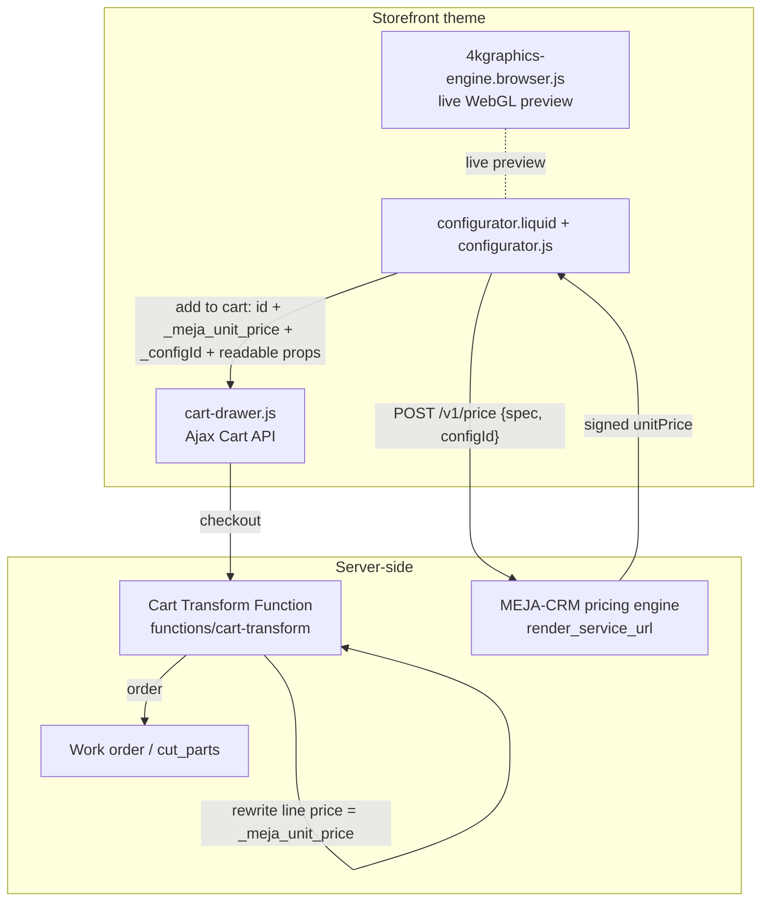

# MEJA configurable pieces — setup & wiring

How the **configurator** (custom drawer boxes, drawer units, cabinet doors, shelves) is
built, and the steps still required to make a configured order price correctly and reach
the workshop. This is the configurator-focused companion to the broader theme runbook in
[`theme/DEPLOY.md`](theme/DEPLOY.md); contracts live in
[`docs/06-API-Contracts.md`](docs/06-API-Contracts.md) and [`api/openapi.yaml`](api/openapi.yaml).

---

## 1. Status at a glance

| Area | State |
| --- | --- |
| Option tabs, exact-size inputs, validation | ✅ built (client) |
| Live 3D preview (Three.js), finish, lighting, downloadable snapshot | ✅ built (client) |
| Add-to-cart with line-item properties → slide-out cart drawer | ✅ built (client) |
| Save / share configurations (localStorage + `#cfg=` deep links) | ✅ built (client) |
| Local price **estimate** (base + option deltas) | ✅ built (client, indicative only) |
| **Authoritative signed price** from the CRM | ⏳ needs CRM endpoint + base product + Cart Transform |
| Live option model from the CRM | ⏳ optional; needs CRM endpoint |
| Server-side 4K render asset | ⏳ needs 4kGraphics `/v1/render` host |

The storefront is fully functional on its own (with an *indicative* price). The three
⏳ items below are what turns it into a real, correctly-priced custom order.

---

## 2. Architecture & data flow



**Principle (Decision D4):** the CRM pricing engine is the single source of truth — the
store never computes the *final* price. The client shows an indicative estimate and, when
`render_service_url` is set, replaces it with the CRM's signed price. The Cart Transform
Function re-applies that signed price server-side at checkout, and it is reconciled again
at `orders/create` (see `docs/06` C3).

### Files

| File | Role |
| --- | --- |
| `theme/sections/configurator.liquid` | Markup, product tabs, embedded option model, base-product settings |
| `theme/assets/configurator.js` | Option/size rendering, validation, price preview + CRM fetch, add-to-cart, save/share, engine wiring |
| `theme/assets/4kgraphics-engine.browser.js` | Drop-in WebGL preview engine (`showFurniture`, `setMaterial`, `setStain`, `setLighting`, `renderSnapshot`) |
| `theme/snippets/price-block.liquid` | Price card, Add button, ♡ save, price-mode indicator |
| `theme/functions/cart-transform/` | Shopify Function that applies the signed price at checkout |

---

## 3. Contracts

### 3.1 Line-item properties the configurator adds

When a configured item is added to the cart, `configurator.js` sends:

| Property | Example | Notes |
| --- | --- | --- |
| `_configId` | `drawerbox:bottom=solid\|finish=oiled\|joinery=dovetail\|wood=walnut\|w21\|d21\|h4` | Stable config key: kind + sorted options + dims (leading `_` ⇒ hidden in cart UI) |
| `_meja_unit_price` | `48.00` (or signed token from CRM) | The price the Cart Transform Function applies |
| `Product` | `Drawer Box` | Readable |
| `Width` / `Depth` / `Height` / `Thickness` | `21 in` | One per editable axis for the kind |
| *option group labels* | `Joinery: Dovetail`, `Wood: Walnut`, `Finish: Hand-oiled`, … | Readable selections |

`spec` sent to the CRM/engine (from `engineSpec()`):
`{ kind, widthMm, depthMm, heightMm, stockThicknessMm, joinery?, drawers?, style? }`
(`kind ∈ { drawerbox, drawerunit, cabinetdoor, shelf }`, dimensions in **millimetres**).

### 3.2 CRM endpoints the client calls (set `render_service_url` to the base host)

**`POST {render_service_url}/v1/price`** — body `{ spec, configId }` → returns:
```json
{ "unitPrice": "48.00", "displayPrice": "$48.00", "amount": 4800, "currency": "USD" }
```
- `unitPrice` → written to `_meja_unit_price` (use a **signed** value in production).
- `displayPrice` (formatted) or `amount` (cents) → shown as the live price.
- Requests are debounced and stale-guarded. On any failure the local estimate stays.

**`GET {render_service_url}/v1/options?kind={kind}`** *(optional)* → returns the option
model for that kind, same shape as the embedded model:
```json
{ "base": 4800, "title": "Drawer Box",
  "groups": [ { "key": "joinery", "label": "Joinery",
    "options": [ { "label": "Dovetail", "value": "dovetail", "delta": 0 } ] } ] }
```
If absent, the embedded model in `configurator.liquid` is used.

> **CORS:** these are browser fetches from the storefront origin, so the CRM must send
> `Access-Control-Allow-Origin` for the store domain.

The same host also serves the server-side render/build-plan endpoints from `docs/06` C4
(`POST /v1/render`, `POST /v1/buildplan`).

---

## 4. Remaining wiring checklist

### 4.1 Base configurable product  *(required for checkout)*
1. Admin → **Products → Add product**, e.g. "Custom Piece". One variant; price is a
   placeholder (the Function overrides it). Turn **inventory tracking off** /
   "continue selling".
2. Theme editor → Configurator section → set **Base configurable product** (`base_product`),
   or paste a variant ID into **Variant ID override** (`base_variant_id`).
   Until set, Add-to-cart is disabled and shows a connect-a-product note.
   *(Optionally create one base product per family.)*

### 4.2 Cart Transform Function  *(required for correct price)*
Deploy `theme/functions/cart-transform/` as a **Shopify Function** inside an app (it is
**not** part of the theme bundle):
```sh
shopify app generate extension   # type: cart_transform (JavaScript)
# move src/run.js + src/run.graphql + shopify.extension.toml into the generated extension
shopify app deploy
```
- Target: `cart.transform.run`; handle `meja-cart-transform`.
- It keys on cart line attributes `_meja_unit_price` + `_configId` and rewrites the line
  to `fixedPricePerUnit`.
- ⚠️ The price verification in `src/run.js` is a **scaffold placeholder** — implement the
  CRM **signed-price** check before production, and keep the `orders/create` reconciliation
  (`docs/06` C3). Requires Shopify **Plus** (or use the **Draft Orders** path for
  CRM-pushed quotes — Decision D10).

### 4.3 CRM pricing/options endpoints  *(makes the price live)*
Stand up `POST /v1/price` (and optionally `GET /v1/options`) per §3.2, with CORS and a
signed `unitPrice`. Then set the host in the theme:

### 4.4 Theme setting
Theme editor → **Brand → 4kGraphics / render service URL** (`settings.render_service_url`).
This single base URL powers the live price/options fetch **and** the server-side `/v1/render`
4K asset. Leave blank to run on the local estimate + embedded options.

### 4.5 Supporting content *(see `theme/DEPLOY.md` §5 for detail)*
- Collections with handles `drawer-boxes`, `drawer-units`, `cabinet-doors`, `shelves`.
- A page on the `page.configurator` template (handle `configurator`).
- Upload the production `4kgraphics-engine.browser.js` if replacing the bundled preview.

---

## 5. Graceful degradation

The configurator never hard-fails when a dependency is missing:

| Missing | Behavior |
| --- | --- |
| Base product | Add-to-cart disabled with an inline "connect a base product" note |
| `render_service_url` | Local price **estimate**; embedded option model; preview engine still runs |
| CRM `/v1/price` errors | Keeps the last good estimate (badge stays "estimate") |
| 3D engine fails to load | Falls back to the static viewer; everything else works |
| JavaScript off | Native form post to `/cart/add` with readable line-item properties |

---

## 6. Local development & checks

```sh
cd theme
shopify theme dev      # live preview against a dev store
shopify theme check    # the same linter CI runs (expect 0 offenses)
```
Repo CI runs `tools/theme_check.py` (sanity) + `theme-check`. JS is plain ES modules —
`node --check theme/assets/<file>.js` syntax-checks it.

---

## 7. References
- [`theme/DEPLOY.md`](theme/DEPLOY.md) — full theme deploy runbook
- [`docs/06-API-Contracts.md`](docs/06-API-Contracts.md) — job queue, render/build-plan, order ingestion, pricing authority
- [`docs/05-Integration-Context.md`](docs/05-Integration-Context.md) — how the store, CRM, Atelier3D and 4kGraphics fit together
- [`theme/functions/cart-transform/README.md`](theme/functions/cart-transform/README.md) — Function details
