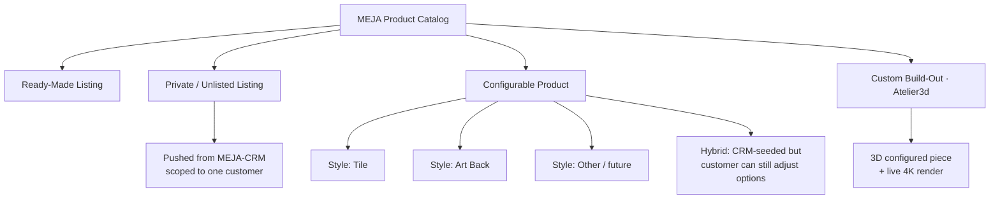
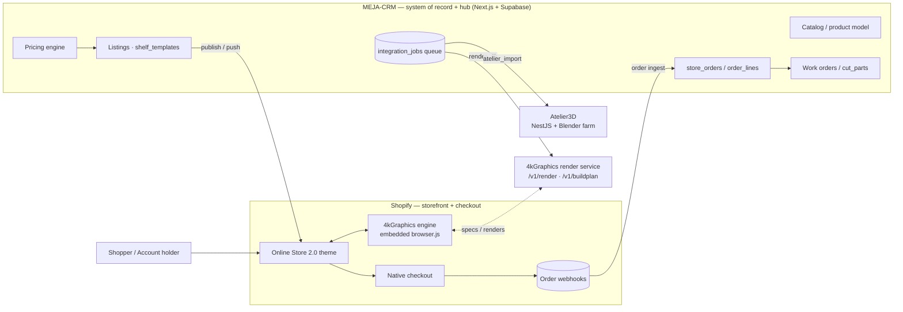
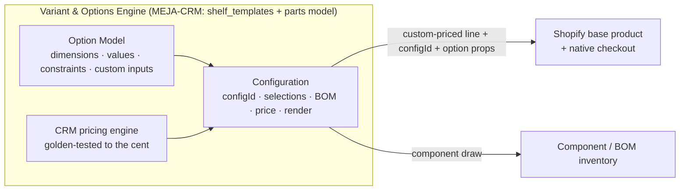
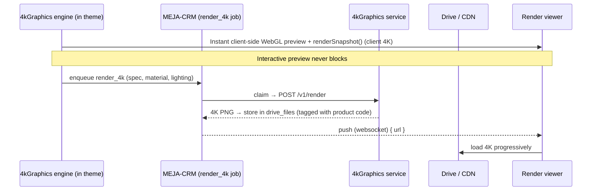
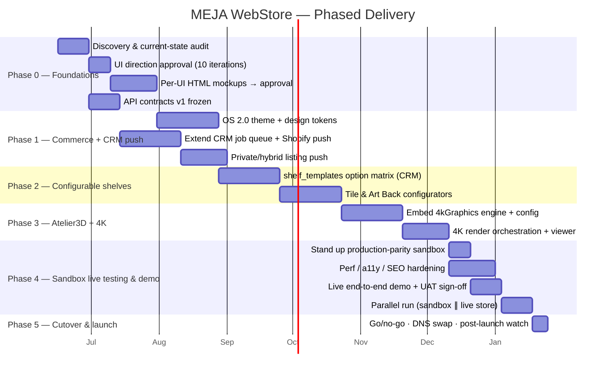

# MEJA Designs WebStore — Master Plan

**Document type:** Complex implementation plan (for approval)
**Version:** 0.2 (Draft — reconciled with the real sibling apps; see [`05-Integration-Context.md`](05-Integration-Context.md))
**Date:** 2026-06-13
**Owner:** MEJA Designs
**Status:** 🟡 Draft — awaiting approval

---

## 0. How to read this document

This is the **single source of truth** for the new mejadesigns.com store. It is organized top-down: vision → scope → architecture → the four integrations → data model → product taxonomy → workflows (summarized; full detail in [`03-Product-Workflows.md`](03-Product-Workflows.md)) → non-functionals → roadmap → cost → risk → KPIs → **open decisions you need to approve**.

Everything marked **🔵 DECISION** is a choice that needs your sign-off; they are collected in §16.

---

## 1. Executive summary

MEJA Designs sells **handcrafted wood wall art, décor, and made-to-order pieces** — most notably a line of **shelves** offered in multiple styles (**Tile**, **Art Back**, and more). Today the catalog is largely fixed listings. The business is increasingly **quote-driven and customized**: a customer wants *their* size, wood, finish, and layout.

The new store turns mejadesigns.com into a **configurable commerce platform** that supports four product modes simultaneously:

1. **Ready-made listings** — buy-now catalog products.
2. **Private (unlisted) listings** — a specific quote pushed from **MEJA‑CRM** to one customer, not shown in public navigation.
3. **Configurable products** — the customer selects options (style, size, wood, finish, mounting); price recalculates live. Shelves are the flagship here (Tile / Art Back / hybrid / others).
4. **Custom build-out (Atelier3d)** — the customer designs a bespoke piece in a 3D configurator with **live 4K rendering**, then checks out.

A **hybrid mode** spans #2 and #3: MEJA‑CRM pushes a *private, pre-customized* listing, **but the customer can still change selected options** before buying.

These systems are **real, in-flight applications** (reviewed 2026-06-13; see [`05-Integration-Context.md`](05-Integration-Context.md)): **MEJA‑CRM** (Next.js 15 + Supabase) is the **business system of record + integration hub** — it owns customers, products, the golden-tested **pricing engine**, quotes, work orders, and **listings**, and already plans the Shopify storefront. **Atelier3D** (React + Three.js + NestJS) is the parametric design studio. **4kGraphics** is the render engine (embeddable Three.js library + headless `/v1/render` service). They connect through the CRM's **typed job-queue contract** (`integration_jobs`), not ad-hoc point-to-point APIs.

**Recommended approach:** build the storefront as a **Shopify Online Store 2.0 theme** (the CRM's own Phase 8 plan) with the **4kGraphics engine embedded** in the theme for live 3D + 4K — its `browser.js` drop-in loads via a `<script>` in any Liquid template. **Shopify owns the storefront + checkout** (PCI-compliant); **MEJA‑CRM is the system of record + hub** (catalog, pricing, listings, order-ingest). Full headless is *not* required — keep it optional for a few flagship-immersive pages only. _(See §16, Decision D1.)_

---

## 2. Goals & non-goals

### 2.1 Goals
- **G1** — Sell ready-made, private/unlisted, configurable, and custom (Atelier3d) products from one storefront and one checkout.
- **G2** — Let MEJA‑CRM **push quotes** as private or hybrid listings, with correct pricing, options, and customer scoping.
- **G3** — Give customers **live option selection** with **real-time price** updates and **4K-quality** visualization.
- **G4** — Extend the CRM's **typed job-queue contract** (`integration_jobs`) and listings/store-order surfaces to connect Shopify ⇄ MEJA‑CRM ⇄ Atelier3D ⇄ 4kGraphics; keep contracts documented and versioned.
- **G5** — Establish a **UI Design Standard** the brand can grow on (see [`02-UI-Design-Standard.md`](02-UI-Design-Standard.md)).
- **G6** — Preserve SEO, brand equity, and existing customer accounts during cutover.

### 2.2 Non-goals (this phase)
- Building MEJA‑CRM, Atelier3D, or 4kGraphics themselves (we integrate via the CRM's existing job queue, listings, and store-order surfaces, and the 4kGraphics engine/service).
- Replacing Shopify checkout or becoming a payment processor.
- Marketplace/multi-vendor features.
- A native mobile app (the storefront is responsive PWA-capable).

---

## 3. Current-state review

> The live sites (mejadesigns.com / .net) are bot-protected, so this review is assembled from public search results and the brief. **Action A0:** confirm/correct this inventory before finalizing scope.

| Aspect | Current state (assessed) |
|--------|--------------------------|
| Brand | MEJA Designs — handmade wood wall art, home/office décor, personalized gifts, custom drawer boxes. |
| Platform | Shopify (URL patterns like `/pages/faq`, `/listing/...` and Etsy presence). |
| Catalog | Fixed listings; made-to-order via messages/Etsy; limited self-serve customization. |
| Shelves | Sold in styles incl. **Tile** and **Art Back**; sizing/finish handled manually. |
| Quoting | Centralized in **MEJA‑CRM** (Next.js 15 + Supabase) — pricing engine golden-tested; quote→work-order live; listings (Phase 8) push to Shopify. |
| Visualization | Static product photography; no live 3D/4K configuration. |
| Gaps | No self-serve configurator, no private/unlisted quote listings, no live rendering, no documented system integration. |

**Implication:** the new store is not a re-skin — it adds *configurable commerce*, *quote-to-listing automation*, and *3D/4K visualization* on top of a Shopify foundation, wired into the **already-built MEJA‑CRM** (quoting, pricing, listings, work orders) and its **Atelier3D** / **4kGraphics** workers. See [`05-Integration-Context.md`](05-Integration-Context.md).

---

## 4. Product taxonomy & terminology

A precise vocabulary so every team means the same thing.



| Term | Definition | Visibility | Pricing source |
|------|------------|-----------|----------------|
| **Ready-Made Listing** | Standard catalog product, fixed or simple variants. | Public | MEJA‑CRM catalog → Shopify |
| **Private / Unlisted Listing** | A quote materialized as a product, reachable only via signed link / customer account. | Hidden from nav, search, sitemap | MEJA‑CRM (locked) |
| **Configurable Product** | Customer-driven options recompute the price. | Public | MEJA‑CRM pricing engine (`shelf_templates`) |
| **Hybrid Listing** | CRM seeds a configuration **and** leaves chosen options editable. | Private or public | MEJA‑CRM pricing engine (locked + editable) |
| **Custom Build-Out** | Atelier3D session designs a bespoke piece; 4K render; quote → cart. | Public entry, private result | Atelier3D BOM → MEJA‑CRM pricing engine |
| **Shelf Style** | A configurable product family. **Tile** and **Art Back** are the two primary styles; the system is **not limited to two** (e.g., Floating, Ledge, Grid, Modular are future styles). | — | — |

> **Maps to the CRM `listings.kind`:** `catalog` = Ready-Made · `private` = Private/Unlisted (quote-required) · `shelf_template` = Configurable & Hybrid shelves. Private listings always originate from a quote (CRM rule).

> **Design principle:** *Styles **and options** are **data**, not code — and not Shopify variants.* Adding a new shelf style, option dimension, or value is a configuration change, never a redeploy. The combinatorial option space (often 10⁵+ combinations — e.g., one Tile-Back shelf = **139,968**) lives in the **Variant & Options Engine** (§5.4), never in Shopify's native variant model (3-option / 2,048-variant limits).

---

## 5. System architecture (recommended)

> The four systems are real apps — see [`05-Integration-Context.md`](05-Integration-Context.md). **MEJA‑CRM is the business system of record + integration hub; Shopify is the storefront + checkout; Atelier3D and 4kGraphics are workers behind the CRM's job queue.**

### 5.1 Context diagram



### 5.2 Layers & responsibilities

| Layer | Responsibility | Actual implementation |
|-------|----------------|------------------------|
| **Shopify (storefront + checkout)** | Renders pages, hosts the embedded 3D/4K configurator, owns cart/checkout/orders/payments/taxes. | **Online Store 2.0 theme** (Liquid + sections) with the **4kGraphics `browser.js`** embedded; native checkout (Plus for Functions — D3/D10). |
| **MEJA‑CRM (system of record + hub)** | Catalog/product model, **pricing engine**, quotes, **listings** (`catalog/private/shelf_template`), **store-order ingestion**, work orders, and the **job queue** that drives the workers. | **Next.js 15 + Supabase (Postgres/RLS) + Drizzle.** Worker API `POST /api/jobs/claim`, `POST /api/jobs/[id]` (bearer `JOBS_WORKER_TOKEN`). |
| **4kGraphics (render worker)** | Live WebGL preview, client-side 4K snapshot, headless server 4K + build-plan; render & cut list share one part layout. | Embeddable engine + headless `POST /v1/render` & `/v1/buildplan` (persistent host — Railway/Fly/VPS). Driven by `render_4k` jobs. |
| **Atelier3D (design worker)** | Bespoke parametric design; exports a draft product (dims + parts) into the CRM. | React + Three.js + NestJS; Blender Cycles farm; driven by `atelier_import` jobs. |

### 5.3 Why an OS 2.0 theme + embedded engine (recommendation rationale)

- **It matches the CRM's own plan** ("Shopify Online Store 2.0 theme in `/storefront` — Phase 8"), so store and CRM stay one program, not two.
- **The 4kGraphics `browser.js` embeds in Liquid** via a `<script type="module">` — live 3D + client-side 4K **without** a headless storefront.
- **Shopify checkout stays native** → PCI scope, fraud, taxes, and payments remain Shopify's.
- **Lower cost/complexity than headless**; full headless stays optional for a few flagship-immersive pages if ever justified (D1).

### 5.4 Variant & Options Engine — *why Shopify-native variants do not fit*

MEJA's configurable products explode combinatorially. A single **Tile-Back shelf** already produces **139,968** combinations:

| Option dimension | Values |
|------------------|:------:|
| Stain | 18 |
| Tile pattern | 18 |
| Length | 8 |
| Tile color | 9 |
| Hook style | 6 |
| **Total combinations** | **18 × 18 × 8 × 9 × 6 = 139,968** |

Shopify cannot model this natively, on **two** independent limits — and a third issue makes it impossible regardless:

1. **Option ceiling:** Shopify allows **3 options per product**; this product needs **5** (Art-Back, custom tile, and custom art add even more). _(Shopify, current as of 2025-10-15.)_
2. **Variant ceiling:** Shopify allows **2,048 variants per product** (raised from 100 on 2025-10-15); 139,968 is **~68× over**.
3. **Un-enumerable inputs:** **custom tile** and **custom art** are free-form (uploaded artwork, bespoke layouts) — an *infinite* space that can never be pre-listed as variants.

**Conclusion: we never model option combinations as Shopify variants.** A dedicated **Variant & Options Engine** owns the option space; Shopify carries only the *result* of a configuration as a custom-priced line item.



**How it works**

| Concern | Approach |
|---------|----------|
| **What's selectable** | The **Option Model** (per family/style) defines *unlimited* dimensions, values, dependencies, constraints, and free-form input types (upload/text). Source of truth in the **CRM (`shelf_templates` + parts/`dim_map`)**; mirrored to Atelier3D for the 3D scene. Adding a stain — or a whole new dimension — is **data**, not code or variants. |
| **Price** | The **CRM pricing engine** (golden-tested to the cent) computes price deterministically from the parts/materials/features model. **Server-side authority** — the client never sets price. |
| **Catalog footprint in Shopify** | **One base "configurable" product per family/style** (a handful of products) — *not* 139,968 variants. The chosen configuration rides on the cart line as **line-item properties + a `configId`**. |
| **Getting the price into checkout** (Decision **D10**) | **A. Cart Transform Function (Shopify Plus):** a base variant sits in the native cart; a server-side Shopify Function rewrites its price to the CRM-computed amount from the attached `configId`. Keeps native cart/checkout UX. · **B. Draft Orders API:** the CRM creates a draft order with a custom-priced line, then converts it to a checkout. Works without Plus; ideal for **CRM-pushed private/hybrid quotes**. |
| **Inventory** | Tracked at the **component / BOM level** (blanks, tiles, hooks, stain), never per combination. Feasibility = component availability, not 139,968 phantom SKUs. |
| **Merchandising & filtering** | Collection filters (e.g., "available in walnut") are driven by **option metadata**, not variants. |
| **Anti-tampering** | Final price is always (re)computed and set **server-side** (Function or Draft Order) and re-validated against `configId` at the `orders/create` webhook. |

**Recommendation:** **Cart Transform Functions on Shopify Plus** for self-serve configurators (native UX), **plus Draft Orders** for CRM-pushed quotes and as a non-Plus fallback. This makes **Shopify Plus (Decision D3) effectively required**, and reinforces **the OS 2.0 theme + embedded engine (D1)** — native variant pickers cannot express this, so the **embedded configurator UI is mandatory** for these products.

---

## 6. API integration specification

Cross-system work is coordinated by **MEJA‑CRM** via its **typed job queue** (`integration_jobs`: enqueue → atomic claim `SKIP LOCKED` → complete → fail-with-requeue ≤3× → reap-stuck) plus Shopify's Admin/Storefront APIs and order webhooks. This gives one hub for auth, retries, idempotency, and versioning.

### 6.1 Integration matrix

| From → To | Direction | Transport | Key operations |
|-----------|-----------|-----------|----------------|
| Theme → Shopify | sync | Liquid + Storefront/Ajax API | read products/collections, cart, native checkout |
| Theme ↔ 4kGraphics engine | in-page | embedded `browser.js` | live 3D preview, `renderSnapshot()` (client 4K), `getBuildPlan()` |
| MEJA‑CRM → Shopify | sync | Admin API + (Cart Transform Fn / Draft Orders) | publish/push **listings** as base products; set configured **line price** server-side + `configId`/option props (§5.4) |
| Shopify → MEJA‑CRM | async | Order webhooks → `store_orders` | ingest `orders/create\|paid\|fulfilled`; buyers without a quote auto-create a CRM customer |
| MEJA‑CRM → 4kGraphics | async | `integration_jobs` `render_4k` → `/v1/render` `/v1/buildplan` | server 4K render + build-plan; result lands in Drive `drive_files` |
| MEJA‑CRM → Atelier3D | async | `integration_jobs` `atelier_import` | bespoke design → **draft product** (dims + parts, `atelier_model_ref`) |
| MEJA‑CRM (internal) | sync | pricing engine + `assembly_cut_list` view | authoritative price + flattened BOM/cut list |

### 6.2 Canonical configuration object (CRM ↔ store)

```jsonc
// A configuration captured from configurator or CRM (aligns with the CRM listing/line model)
{
  "configurationId": "cfg_01H...",          // idempotency key
  "source": "atelier3d | crm | storefront",
  "productFamily": "shelf",
  "style": "tile | art_back | floating | ...",
  "options": {                               // selected, validated against the option model
    "width_in": 36, "height_in": 12, "depth_in": 6,
    "wood": "walnut", "finish": "matte",
    "tileCount": 9, "backArt": "asset_123", "mount": "floating"
  },
  "bom": [ { "sku": "WAL-BLANK", "qty": 1 }, { "sku": "TILE-3x3", "qty": 9 } ],
  "price": { "currency": "USD", "amount": 24800, "breakdown": [/* line items */] },
  "render": { "previewUrl": "https://cdn/.../preview.webp",
              "render4kUrl": "https://cdn/.../4k.webp", "status": "ready" },
  "customerScope": { "type": "public | private", "customerId": "cus_..." },
  "expiresAt": "2026-07-13T00:00:00Z"
}
```

### 6.3 Quote-to-listing push (MEJA‑CRM → store)

```mermaid
sequenceDiagram
    participant CRM as MEJA-CRM (hub)
    participant SH as Shopify Admin
    participant TH as Theme (storefront)
    CRM->>CRM: Accept quote → "List on Shopify" (listing kind = private / shelf_template)
    CRM->>CRM: Validate options; idempotency on quoteId
    CRM->>SH: Create base product/listing (no variants) + metafields (visibility=private)
    SH-->>CRM: productId
    CRM->>CRM: Store listing↔quote↔product link, signed access token, expiry
    Note over TH: Customer opens signed private URL
    TH->>SH: Storefront API: fetch private product by token
    TH-->>TH: Render listing (editable options if hybrid)
```

**Rules:**
- **Idempotency:** `quoteId` is the dedupe key; re-push updates the listing, never duplicates.
- **Locked vs. editable:** CRM marks each option `locked:true|false`. Locked options render read-only; unlocked render as editable controls (this is what makes a listing *hybrid*).
- **Visibility:** private listings get `metafield: visibility=private`, excluded from collections, search, sitemap, and require a **signed, expiring access token** or logged-in scoped customer.
- **Pricing authority:** the **MEJA‑CRM pricing engine is the sole authority** for all options (locked and editable); the store never computes price — it displays the CRM number.

### 6.4 Live 4K rendering



- **Two-tier visualization:** instant client-side **WebGL preview** (and `renderSnapshot()` client 4K) for interactivity; **server-side 4K** (`render_4k` → `/v1/render`) for hero shots, PDP, and order records. Never block interaction on the 4K job.
- **Caching:** key 4K assets by a hash of the configuration so identical configs reuse renders.
- **BOM = the build plan:** the cut list/BOM comes from 4kGraphics `getBuildPlan()` / `/v1/buildplan` and the CRM `assembly_cut_list` view — render and cut list derive from one part layout, so they can never disagree.
- **Order capture:** the chosen config's 4K URL + build plan are attached to the order line (`configId` in metafields/line-item properties) so production and the customer see exactly what was bought.

### 6.5 Auth, versioning, reliability

- **Auth:** OAuth2 client-credentials / signed webhooks (HMAC) between systems; short-lived signed URLs for private listings and render assets.
- **Versioning:** every external contract is `v1`-prefixed; breaking changes ship a new version, old version deprecated on a published schedule.
- **Reliability:** all async consumers are **idempotent**; failed jobs **requeue (≤3×) then reap-stuck** (the CRM `integration_jobs` contract) with alerting; order webhooks are idempotent; every cross-system call is correlation-ID traced.
- **Secrets:** stored in a managed secret store; never in the storefront bundle.

---

## 7. Data model (essentials)

The authoritative model is the **MEJA‑CRM Postgres schema** (approved ERD; see [`05-Integration-Context.md`](05-Integration-Context.md)). Store-relevant entities:

```mermaid
erDiagram
    quotes ||--o{ listings : "pushed as"
    product_types ||--o{ listings : "catalogued in"
    shelf_templates ||--o{ listings : "option matrix for"
    listings ||--o{ order_lines : "purchased via"
    store_orders ||--o{ order_lines : contains
    store_orders ||--o| work_orders : "linked to"
    quote_versions ||--o| work_orders : generates
    work_orders ||--|{ wo_items : contains
    wo_items ||--|{ cut_parts : "cut list"
    product_types ||--|{ product_parts : "built from"
    product_types ||--o{ product_children : assembles
    integration_jobs }o--|| listings : "render_4k / push"

    listings { string platform; string kind; uuid product; uuid quote; numeric price; string status }
    shelf_templates { uuid id; json option_matrix }
    store_orders { string shopify_order_id; uuid customer; string status }
    integration_jobs { string kind; string status; json payload }
```

- **MEJA‑CRM (Supabase Postgres) is the authoritative data model** — products, the pricing engine, quotes, work orders, **listings**, **shelf_templates**, **store_orders**.
- **Shopify holds** the published storefront mirror: base products (a handful per family/style — **not** option combinations), component-level inventory, native cart/checkout/orders.
- **Configurable options live in `shelf_templates` + the parts/`dim_map` model**; the flattened BOM/cut list comes from the CRM `assembly_cut_list` view and 4kGraphics `getBuildPlan()` — never recomputed separately.
- **Conventions** (CRM ERD): `uuid` PKs, `numeric(12,2)` money (never floats), `timestamptz` audit columns, soft-archive via `status`/`archived_at`; **immutable pricing snapshots** on quote line items.
- **Metafields / line-item properties** carry `configId` + the config snapshot + 4K URL into Shopify so checkout/back-office see exactly what was bought.

---

## 8. Storefront information architecture

| Route | Page type | Notes |
|-------|-----------|-------|
| `/` | Home | Brand story, featured collections, configurator entry, social proof. |
| `/collections/:handle` | Collection / catalog | Filter, sort, quick-view. |
| `/products/:handle` | Product (ready-made) | Standard PDP. |
| `/configure/:family/:style?` | Configurator | Atelier3d surface + option panel + 4K viewer + live price. |
| `/q/:signedToken` | Private/hybrid listing | Quote-backed PDP; editable options if hybrid; expiry aware. |
| `/cart` | Cart | Shows config snapshot + render thumbnail per line. |
| `/account` | Account | Orders, saved configurations, private quotes. |
| `/account/quotes` | My quotes | Active private/hybrid listings pushed from CRM. |
| `/pages/*` | Content | About, FAQ, care, shipping, **made-to-order policy (no returns/exchanges — all items custom-made)**. |
| Checkout | Shopify-hosted | Native, PCI-scoped. |

Full layouts, components, and the **10 design iterations** are in [`02-UI-Design-Standard.md`](02-UI-Design-Standard.md).

---

## 9. Product workflows (summary)

Each product type's full sequence diagram and step list is in [`03-Product-Workflows.md`](03-Product-Workflows.md). At a glance:

| Product type | Entry | Configuration | Pricing | Visualization | Checkout |
|--------------|-------|---------------|---------|---------------|----------|
| Ready-made | Collection/PDP | none/simple variants | CRM → Shopify | product photos | native |
| Private/unlisted | Signed link / account | locked | CRM engine | CRM render / 4K | native |
| Configurable (shelves) | Configurator | full options | CRM engine | WebGL + 4K | native |
| Hybrid | Signed link / account | partial (editable) | CRM engine | WebGL + 4K | native |
| Custom (Atelier3D) | Configurator | bespoke 3D | BOM → CRM engine | WebGL + 4K | native |

---

## 10. Non-functional requirements

| Area | Requirement |
|------|-------------|
| **Performance** | LCP < 2.5s on PDP/collection (4K loads progressively, never blocks); configurator interaction < 100ms client-side. |
| **Availability** | Storefront 99.9%; checkout inherits Shopify SLA; render engine degradation must not block buying (fallback to WebGL preview). |
| **Accessibility** | WCAG 2.2 AA across storefront; configurator keyboard-operable with non-visual fallbacks. |
| **SEO** | SSR for public pages; clean URLs; structured data; private listings excluded from indexing. |
| **Security** | Signed/expiring private URLs; HMAC webhooks; least-privilege API tokens; no secrets in client bundle. |
| **Privacy** | Customer-scoped private listings never leak across accounts; PII stays in Shopify/CRM, not the storefront cache. |
| **Observability** | Correlation IDs end-to-end; dashboards for render queue depth, webhook DLQ, push success rate. |
| **i18n/currency** | Architecture supports Shopify Markets (multi-currency) even if launch is single-region. |

---

## 11. Phased roadmap



| Phase | Outcome | "Done" means |
|-------|---------|--------------|
| **0 — Foundations** | Approved direction + frozen contracts. | UI iteration chosen; **every design-standard UI has an approved HTML mockup (mockup-first gate, UI Standard §9)**; API v1 signed off; current-state confirmed. |
| **1 — Commerce + CRM push** | Sell ready-made; CRM can push private/hybrid listings. | A real quote pushes to a working private PDP and checks out. |
| **2 — Configurable shelves** | Self-serve Tile/Art Back with live price. | Customer configures a shelf and buys; price matches rules. |
| **3 — Atelier3d + 4K** | Bespoke design with live 4K. | Custom piece designed in 3D, 4K render attached to order. |
| **4 — Sandbox live testing & demo** | A production-parity sandbox where the whole store is exercised **live** and demoed for sign-off **before any swap**. The existing store keeps serving customers untouched. | All product types + all 4 integrations pass live end-to-end in sandbox; stakeholder demo signed off; NFRs (perf/a11y/SEO) met; parallel run clean; **go/no-go = GO**. |
| **5 — Cutover & launch** | Production swap from the existing store. | 301 map live; DNS swapped; rollback tested & on standby; post-launch monitoring green. |

> **Mockup-first gate (Phase 0–1):** per the UI Standard §9, **every UI ships an approved HTML mockup before any theme code is written.** No UI is build-ready without an approved mockup; the approved mockups are the reference for the §11.1 sandbox demo.

**Before the existing mejadesigns.com is swapped for the new store, everything runs first in a production-parity sandbox that is exercised *live* and demoed for sign-off.** The current store keeps serving real customers, untouched, until the go/no-go gate passes — so there is zero customer risk during testing.

**Sandbox environment (mirrors production, fully isolated data):**

| Component | Sandbox form |
|-----------|--------------|
| Shopify | Development/preview store (or password-protected staging theme) using a **test payment gateway** (Shopify Bogus Gateway) — no real charges. |
| MEJA‑CRM | CRM sandbox/test tenant pushing **demo** quotes only (no real customer PII). |
| Atelier3d | Sandbox project + keys; same option models as production. |
| 4K render engine | Test render queue writing to a **non-production** CDN bucket. |
| MEJA‑CRM hub + job queue | Staging deployment (Supabase + Next.js) with its own DB, secrets, and `integration_jobs` worker endpoints. |

**Live demo scope — every workflow exercised end-to-end, for real, in the sandbox:**
- Ready-made purchase → test checkout → order created.
- CRM pushes a **private/unlisted** quote → signed link opens → buy.
- **Configurable shelf** (Tile, Art Back, **and** at least one additional style) → live price + 4K render → buy.
- **Hybrid** listing → edit unlocked options → price/render update → buy.
- **Atelier3d custom build** → 3D design → 4K render → buy and/or route to a CRM quote.
- Order → fulfillment packet (config + BOM + 4K render) reaches ops.
- **Failure drills:** render engine down (WebGL fallback), expired private link, invalid configuration, CRM-vs-rules price reconciliation.

**Demo & UAT:** a scheduled walkthrough for stakeholders on the live sandbox URL; UAT scripts per product type; defects logged, triaged, and re-tested; accessibility (WCAG 2.2 AA) and performance audits run against the sandbox.

**Parallel run (soft launch):** for ~1–2 weeks the new store runs **alongside** the existing live store — behind a password, limited audience, or feature flag — so pricing, behavior, and integrations can be compared against today's store with **no customer impact**.

**Go / no-go checklist — all must be GREEN to authorize the swap:**
- [ ] All five product types pass **live** end-to-end in the sandbox.
- [ ] All four integrations (Shopify, MEJA‑CRM, Atelier3d, 4K render) verified live.
- [ ] Stakeholder demo signed off.
- [ ] Performance, accessibility (AA), and SEO-parity audits pass.
- [ ] 301 redirect map verified; private listings excluded from indexing.
- [ ] Rollback plan tested and on standby.
- [ ] Parallel run shows no blocking discrepancies vs. the existing store.

Only after a recorded **GO** decision does **Phase 5** perform the cutover. The existing store remains the **rollback target** throughout launch.

---

## 12. Team & cost (planning placeholders)

> **Action A1:** replace with real vendor quotes/headcount. These are planning placeholders only.

| Role | Phase focus |
|------|-------------|
| Solution architect | All phases (part-time) |
| Storefront engineer(s) | P1–P4 |
| Integration/backend engineer(s) | P1–P3 |
| 3D/graphics engineer | P3 |
| UI/UX designer | P0–P2 |
| QA | P1–P4 |
| Project lead | All |

Recurring cost drivers to budget: **Shopify (Plus tier — TBD)**, the **4kGraphics render service** (persistent host — Railway/Fly/VPS) + GPU/compute, CDN/Drive egress, **MEJA‑CRM hosting** (Vercel + Supabase), Atelier3D render farm, and monitoring.

---

## 13. Risks & mitigations

| # | Risk | Likelihood | Impact | Mitigation |
|---|------|-----------|--------|------------|
| R1 | Sibling-app contracts (CRM job queue, 4kGraphics, Atelier3D) | **Low (reviewed)** | Med | Contracts documented 2026-06-13 ([`05-Integration-Context.md`](05-Integration-Context.md)); track their in-progress phases (CRM Listings P8, job-queue P7, render/Atelier worker services). |
| R2 | 4K render latency hurts UX | Med | High | Two-tier (instant WebGL + async `render_4k`); cache by config hash; never block checkout. |
| R3 | Private-listing leakage | Low | High | Signed expiring URLs + customer scoping + exclusion from index; security review. |
| R4 | Pricing drift (store vs CRM) | Low | High | **CRM pricing engine is the sole authority** (golden-tested to the cent); store only displays it; reconcile at order ingest. |
| R5 | Storefront build complexity/cost | Low | Med | **OS 2.0 theme + embedded engine** (not headless) keeps it simple; headless optional later. |
| R6 | SEO/traffic loss at cutover | Med | High | 301 map, parity audit, **sandbox parallel run + go/no-go gate (§11.1)**, staged rollout, monitoring; existing store kept as rollback target. |
| R7 | Variant explosion exceeds Shopify limits (3 options / 2,048 variants); custom tile/art are un-enumerable | **High** | High | **Variant & Options Engine (§5.4)**: options as data + server-side pricing + custom-priced line items (Cart Transform / Draft Orders); inventory at BOM level; never model combinations as native variants. |
| R8 | "Shelf" (Tile/Art Back) is not yet a 4kGraphics parametric `kind` | Med | Med | Author Tile/Art Back as a parametric component (Atelier3D/4kGraphics) for live 3D + auto build-plan, or model via `shelf_templates` only (Decision **D11**). |

---

## 14. KPIs / success metrics

- **Configurator conversion rate** (sessions → add-to-cart).
- **Quote-to-order rate** for CRM-pushed private/hybrid listings.
- **Time-to-publish** a pushed quote (target: seconds, automated).
- **Render success rate** and median 4K render time.
- **PDP performance** (LCP) and **accessibility** (automated AA pass rate).
- **Revenue mix** across the four product modes.

---

## 15. Assumptions & dependencies

- **MEJA‑CRM** (Next.js 15 + Supabase) exposes the **`integration_jobs` worker API** + listings/store-order surfaces (Listings P8 / job-queue P7 land on schedule).
- **Atelier3D** exports a draft product via `atelier_import`; embeddable for design where needed.
- **4kGraphics** provides the **embeddable engine** (live preview + client 4K) and a **`/v1/render` + `/v1/buildplan`** service on a persistent host.
- **Shopify** plan supports OS 2.0 + the API/metafield/checkout-extensibility (Functions) needs — **Plus likely required** (D3/D10).
- Brand assets + the CRM **Indigo Atelier `--mj-*` tokens** are available for the design system.

---

## 16. 🔵 Open decisions for approval

| ID | Decision | Options | Recommendation |
|----|----------|---------|----------------|
| **D1** | Storefront architecture | (a) **Shopify OS 2.0 theme + embedded 4kGraphics engine** · (b) Hybrid-headless · (c) Full headless | **(a)** — matches the CRM's Phase 8 plan; the engine embeds in Liquid; lowest cost. Headless optional for flagship pages. _(Revised after reviewing the sibling apps.)_ |
| **D2** | Primary UI iteration | One of the 10 in [`02-UI-Design-Standard.md`](02-UI-Design-Standard.md) | Shortlist **#1 Atelier Gallery**, **#3 Modern Luxe**, **#10 Showroom 3D Immersive**; pick one + accents. |
| **D3** | Shopify tier | Standard/Advanced vs **Plus** | **Plus** if checkout extensibility / scripting / volume warrant. |
| **D4** | Pricing authority model | **CRM-only** / Rules-only / Hybrid | **CRM pricing engine is the sole authority** (golden-tested to the cent); the store never computes price. _(Revised — there is one real pricing engine.)_ |
| **D5** | Private-listing access | Signed expiring URL / account-gated / both | **Both** (signed URL *and* customer scope). |
| **D6** | Phase 1 scope | Commerce only vs Commerce + CRM push | **Commerce + CRM push** (highest business value early). |
| **D7** | Render fallback policy | Block on 4K vs **WebGL-first** | **WebGL-first**, 4K async, never block. |
| **D8** | New shelf styles beyond Tile/Art Back at launch? | which, if any | Confirm launch styles; system supports unlimited via data. |
| **D9** | Pre-swap parallel-run length & demo sign-off group (§11.1) | 1 wk / 2 wks / longer · who signs off | **~2 weeks** parallel run; named stakeholders sign the recorded go/no-go before swap. |
| **D10** | How configured purchases reach Shopify checkout (§5.4) | Cart Transform Functions (Plus) / Draft Orders API / both | **Both** — Cart Transform on Plus for self-serve native UX; Draft Orders for CRM-pushed quotes & non-Plus fallback. Makes **D3 = Plus** effectively required. |
| **D11** | Shelf (Tile/Art Back) as true 3D | Parametric component (Atelier3D/4kGraphics) / `shelf_templates` matrix only | **Author as a parametric component** for live 3D + auto build-plan; `shelf_templates` holds the option matrix. _(New — shelf isn't yet a render `kind`.)_ |
| **D12** | Store design tokens | Adopt CRM **Indigo Atelier `--mj-*`** / bespoke | **Adopt Indigo Atelier tokens** for one-brand consistency across CRM, Atelier3D, and store. _(New.)_ |

---

## 17. Appendices

- **A. Glossary** — see §4 table.
- **B. API objects** — see §6.2.
- **C. Diagrams** — Mermaid sources are inline; rendered automatically on GitHub.
- **D. Related docs** — [UI Design Standard](02-UI-Design-Standard.md), [Product Workflows](03-Product-Workflows.md), [Mockups](../mockups/index.html).
- **E. Integration context** — [Integration Context](05-Integration-Context.md) — the real sibling apps (MEJA‑CRM, Atelier3D, 4kGraphics) and their contracts.

---

_End of Master Plan (Draft v0.1). Please review §16 and approve or annotate._
