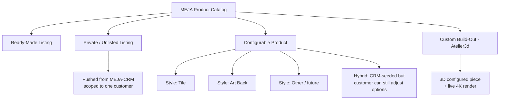
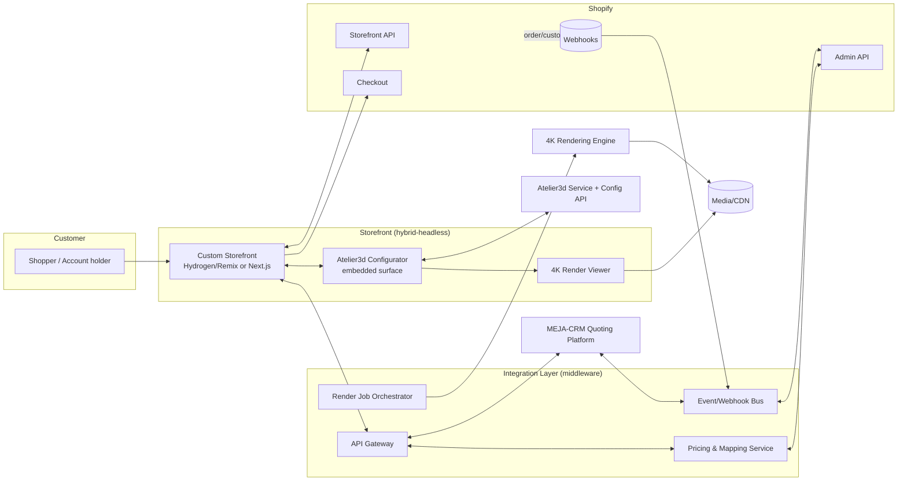
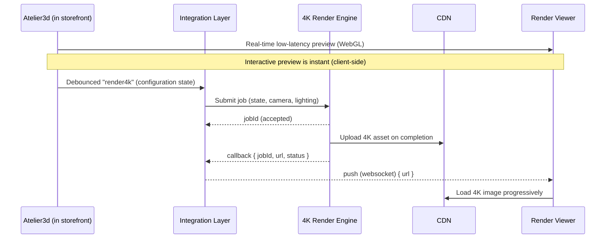
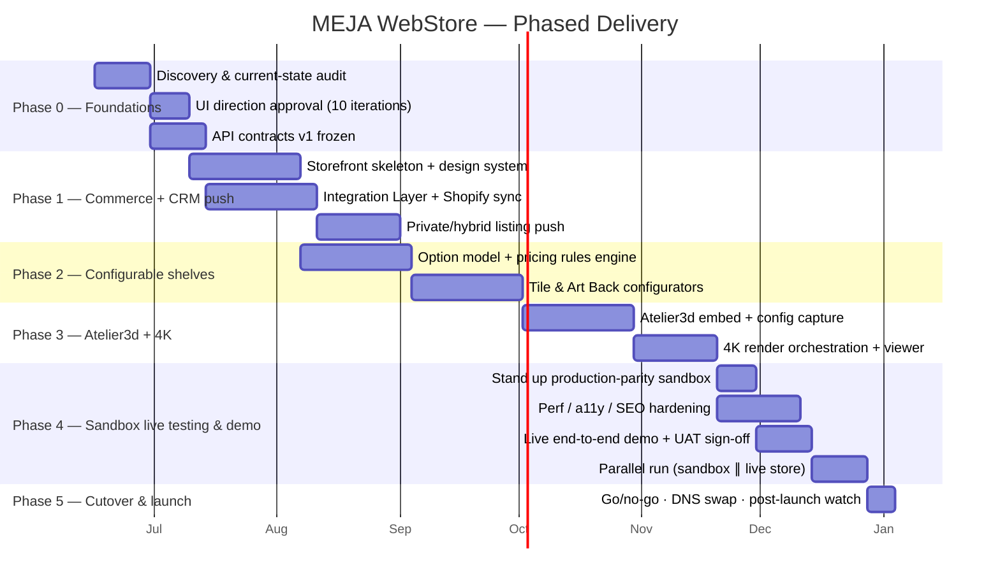

# MEJA Designs WebStore — Master Plan

**Document type:** Complex implementation plan (for approval)
**Version:** 0.1 (Draft)
**Date:** 2026-06-13
**Owner:** MEJA Designs
**Status:** 🟡 Draft — awaiting approval

---

## 0. How to read this document

This is the **single source of truth** for the new mejadesigns.com store. It is organized top-down: vision → scope → architecture → the four integrations → data model → product taxonomy → workflows (summarized; full detail in [`03-Product-Workflows.md`](03-Product-Workflows.md)) → non-functionals → roadmap → cost → risk → KPIs → **open decisions you need to approve**.

Everything marked **🔵 DECISION** is a choice that needs your sign-off; they are collected in §16.

---

## 1. Executive summary

MEJA Designs sells **handcrafted wood wall art, décor, and made-to-order pieces** — most notably a line of **shelves** offered in multiple styles (**Tile**, **Art Back**, and more). Today the catalog is largely fixed listings. The business is increasingly **quote-driven and customized**: a customer wants *their* size, wood, finish, and layout.

The new store turns mejadesigns.com into a **configurable commerce platform** that supports four product modes simultaneously:

1. **Ready-made listings** — buy-now catalog products.
2. **Private (unlisted) listings** — a specific quote pushed from **MEJA‑CRM** to one customer, not shown in public navigation.
3. **Configurable products** — the customer selects options (style, size, wood, finish, mounting); price recalculates live. Shelves are the flagship here (Tile / Art Back / hybrid / others).
4. **Custom build-out (Atelier3d)** — the customer designs a bespoke piece in a 3D configurator with **live 4K rendering**, then checks out.

A **hybrid mode** spans #2 and #3: MEJA‑CRM pushes a *private, pre-customized* listing, **but the customer can still change selected options** before buying.

All systems talk over **APIs** through a thin **Integration Layer**, with **Shopify** as the commerce system of record.

**Recommended approach:** a **hybrid-headless** build — Shopify owns commerce (catalog, cart, checkout, orders, payments, customers); a custom storefront renders rich product/configurator experiences and hosts the Atelier3d + 4K rendering surfaces. This balances Shopify's reliability and PCI-compliant checkout with the UX freedom that live 3D/4K configuration demands. _(See §16, Decision D1 for alternatives.)_

---

## 2. Goals & non-goals

### 2.1 Goals
- **G1** — Sell ready-made, private/unlisted, configurable, and custom (Atelier3d) products from one storefront and one checkout.
- **G2** — Let MEJA‑CRM **push quotes** as private or hybrid listings, with correct pricing, options, and customer scoping.
- **G3** — Give customers **live option selection** with **real-time price** updates and **4K-quality** visualization.
- **G4** — Provide a **documented, versioned API contract** between Shopify, MEJA‑CRM, Atelier3d, and the render engine.
- **G5** — Establish a **UI Design Standard** the brand can grow on (see [`02-UI-Design-Standard.md`](02-UI-Design-Standard.md)).
- **G6** — Preserve SEO, brand equity, and existing customer accounts during cutover.

### 2.2 Non-goals (this phase)
- Building MEJA‑CRM itself (we integrate with it; we assume it exposes/consumes APIs).
- Replacing Shopify checkout or becoming a payment processor.
- Marketplace/multi-vendor features.
- A native mobile app (the storefront is responsive PWA-capable).

---

## 3. Current-state review

> The live sites (mejadesigns.com / .net) are bot-protected, so this review is assembled from public search results and the brief. **Action A0:** confirm/correct this inventory before finalizing scope.

| Aspect | Current state (assessed) |
|--------|--------------------------|
| Brand | MEJA Designs — handmade wood wall art, home/office décor, personalized gifts, custom drawer boxes. |
| Platform | Shopify (URL patterns like `/pages/faq`, `/listing/...` and Etsy presence). |
| Catalog | Fixed listings; made-to-order via messages/Etsy; limited self-serve customization. |
| Shelves | Sold in styles incl. **Tile** and **Art Back**; sizing/finish handled manually. |
| Quoting | Handled outside the store (the future **MEJA‑CRM** centralizes this). |
| Visualization | Static product photography; no live 3D/4K configuration. |
| Gaps | No self-serve configurator, no private/unlisted quote listings, no live rendering, no documented system integration. |

**Implication:** the new store is not a re-skin — it adds *configurable commerce*, *quote-to-listing automation*, and *3D/4K visualization* on top of a Shopify foundation.

---

## 4. Product taxonomy & terminology

A precise vocabulary so every team means the same thing.



| Term | Definition | Visibility | Pricing source |
|------|------------|-----------|----------------|
| **Ready-Made Listing** | Standard catalog product, fixed or simple variants. | Public | Shopify |
| **Private / Unlisted Listing** | A quote materialized as a product, reachable only via signed link / customer account. | Hidden from nav, search, sitemap | MEJA‑CRM (locked) |
| **Configurable Product** | Customer-driven options recompute SKU + price. | Public | Pricing rules engine |
| **Hybrid Listing** | CRM seeds a configuration **and** leaves chosen options editable. | Private or public | CRM baseline + rules for editable options |
| **Custom Build-Out** | Atelier3d session designs a bespoke piece; 4K render; quote → cart. | Public entry, private result | Atelier3d BOM → pricing rules |
| **Shelf Style** | A configurable product family. **Tile** and **Art Back** are the two primary styles; the system is **not limited to two** (e.g., Floating, Ledge, Grid, Modular are future styles). | — | — |

> **Design principle:** *Style* is data, not code. Adding a new shelf style (or an entirely new configurable family) is a catalog/configuration change, never a redeploy.

---

## 5. System architecture (recommended)

### 5.1 Context diagram



### 5.2 Layers & responsibilities

| Layer | Responsibility | Example tech (illustrative) |
|-------|----------------|------------------------------|
| **Storefront** | Renders pages, configurator, render viewer; reads catalog via Storefront API; sends to Shopify checkout. | Shopify Hydrogen/Remix on Oxygen, **or** Next.js; React; TypeScript. |
| **Integration Layer** | The glue: auth, mapping, pricing, webhook fan-out, render orchestration, idempotency, retries. | Node/TypeScript service; queue (e.g., SQS/PubSub); Postgres for mapping/state. |
| **Shopify (system of record)** | Catalog, variants, inventory, cart, checkout, orders, customers, payments, taxes. | Shopify Plus recommended for scripting/checkout extensibility. |
| **MEJA‑CRM** | Quote authoring; pushes private/hybrid listings; receives order status. | External; integrates via REST + webhooks. |
| **Atelier3d** | 3D configuration logic, scene/state, BOM output. | Embedded SDK + Config API. |
| **4K Render Engine** | High-resolution render jobs from configuration state. | Async job API → CDN asset URLs. |

### 5.3 Why hybrid-headless (recommendation rationale)

- **Live 4K + 3D** needs a custom canvas, async render handling, and viewer UX that a stock Liquid theme constrains.
- **Private/hybrid listings** need fine-grained, customer-scoped visibility and signed access that's cleaner in a custom storefront.
- **Shopify checkout stays native** → PCI scope, fraud, taxes, and payments remain Shopify's problem, not ours.
- We can **start native + apps** for speed and **graduate pages to headless** (see Decision D1 and the phased roadmap).

---

## 6. API integration specification

All cross-system calls go through the **Integration Layer**. No system calls another's internals directly; this gives us one place for auth, logging, retries, idempotency, and versioning.

### 6.1 Integration matrix

| From → To | Direction | Transport | Key operations |
|-----------|-----------|-----------|----------------|
| Storefront → Shopify | sync | Storefront API (GraphQL) | read products/collections, create cart, go to checkout |
| Integration Layer → Shopify | sync | Admin API (GraphQL/REST) | create/update products & variants, set metafields, manage publications/visibility |
| Shopify → Integration Layer | async | Webhooks | `orders/create`, `orders/paid`, `orders/fulfilled`, `customers/*` |
| MEJA‑CRM → Integration Layer | async + sync | Webhook + REST | push quote → create private/hybrid listing; price updates; expirations |
| Integration Layer → MEJA‑CRM | sync | REST | acknowledge listing creation; send order status; reconcile |
| Storefront ↔ Atelier3d | sync | Embedded SDK + Config API | start/resume session, read option model, emit configuration + BOM |
| Integration Layer → 4K Render | async | Job API | submit render job (config state) → poll/callback → CDN URL |
| 4K Render → CDN | one-way | upload | store rendered hi-res assets |

### 6.2 Canonical objects (Integration Layer vocabulary)

```jsonc
// A configuration captured from configurator or CRM
{
  "configurationId": "cfg_01H...",          // idempotency key
  "source": "atelier3d | crm | storefront",
  "productFamily": "shelf",
  "style": "tile | art_back | floating | ...",
  "options": {                               // selected, validated against the option model
    "width_in": 36, "height_in": 12, "depth_in": 6,
    "wood": "walnut", "finish": "matte",
    "tileCount": 9, "backArt": "asset_123", "mount": "floating"
  },
  "bom": [ { "sku": "WAL-BLANK", "qty": 1 }, { "sku": "TILE-3x3", "qty": 9 } ],
  "price": { "currency": "USD", "amount": 24800, "breakdown": [/* line items */] },
  "render": { "previewUrl": "https://cdn/.../preview.webp",
              "render4kUrl": "https://cdn/.../4k.webp", "status": "ready" },
  "customerScope": { "type": "public | private", "customerId": "cus_..." },
  "expiresAt": "2026-07-13T00:00:00Z"
}
```

### 6.3 Quote-to-listing push (MEJA‑CRM → store)

```mermaid
sequenceDiagram
    participant CRM as MEJA-CRM
    participant IL as Integration Layer
    participant SH as Shopify Admin
    participant ST as Storefront
    CRM->>IL: POST /quotes/push (quote + options + price + scope)
    IL->>IL: Validate against option model; idempotency check
    IL->>SH: Create product + variants + metafields (visibility=private)
    SH-->>IL: productId, variantIds
    IL->>IL: Store mapping (quoteId ↔ productId), signed access token
    IL-->>CRM: 201 { productId, privateUrl, expiresAt }
    Note over ST: Customer opens signed private URL
    ST->>SH: Storefront API: fetch private product by token
    ST-->>ST: Render listing (editable options if hybrid)
```

**Rules:**
- **Idempotency:** `quoteId` is the dedupe key; re-push updates, never duplicates.
- **Locked vs. editable:** CRM marks each option `locked:true|false`. Locked options render read-only; unlocked render as editable controls (this is what makes a listing *hybrid*).
- **Visibility:** private listings get `metafield: visibility=private`, excluded from collections, search, sitemap, and require a **signed, expiring access token** or logged-in scoped customer.
- **Pricing authority:** for private/locked options, CRM price is authoritative; for editable options, the **Pricing Rules Engine** recomputes deltas.

### 6.4 Live 4K rendering



- **Two-tier visualization:** instant client-side **WebGL preview** for interactivity; **server-side 4K** for hero shots, PDP, and order records. Never block interaction on the 4K job.
- **Caching:** key 4K assets by a hash of the configuration so identical configs reuse renders.
- **Order capture:** the chosen config's 4K URL + BOM are attached to the order line item (Shopify metafields/line-item properties) so production and the customer see exactly what was bought.

### 6.5 Auth, versioning, reliability

- **Auth:** OAuth2 client-credentials / signed webhooks (HMAC) between systems; short-lived signed URLs for private listings and render assets.
- **Versioning:** every external contract is `v1`-prefixed; breaking changes ship a new version, old version deprecated on a published schedule.
- **Reliability:** all async consumers are **idempotent**; failed webhooks go to a **dead-letter queue** with retry + alerting; every cross-system call is correlation-ID traced.
- **Secrets:** stored in a managed secret store; never in the storefront bundle.

---

## 7. Data model (essentials)

```mermaid
erDiagram
    PRODUCT ||--o{ VARIANT : has
    PRODUCT ||--o{ OPTION_MODEL : "configured by"
    PRODUCT }o--|| VISIBILITY : "scoped by"
    QUOTE ||--|| PRODUCT : "materializes as"
    CONFIGURATION ||--|| RENDER_ASSET : "produces"
    CONFIGURATION }o--|| PRICING_RULESET : "priced by"
    ORDER ||--o{ ORDER_LINE : contains
    ORDER_LINE }o--|| CONFIGURATION : "snapshot of"

    PRODUCT { string shopifyId; string family; string style; string visibility }
    OPTION_MODEL { json options; json constraints; json dependencies }
    QUOTE { string crmQuoteId; string customerId; string status; date expiresAt }
    CONFIGURATION { string configId; json options; json bom; money price }
    RENDER_ASSET { string previewUrl; string render4kUrl; string status }
    PRICING_RULESET { string id; json baseRates; json modifiers }
```

- **Shopify holds** products, variants, inventory, orders, customers (system of record).
- **Integration Layer DB holds** the *mapping & state* Shopify can't model well: option models, configurations, render-job state, quote↔product links, pricing rulesets, signed-access tokens.
- **Metafields** carry per-product config schema, visibility flags, and per-line-item config snapshots into Shopify so back-office/fulfillment can see them.

---

## 8. Storefront information architecture

| Route | Page type | Notes |
|-------|-----------|-------|
| `/` | Home | Brand story, featured collections, configurator entry, social proof. |
| `/collections/:handle` | Collection / catalog | Filter, sort, quick-view. |
| `/products/:handle` | Product (ready-made) | Standard PDP. |
| `/configure/:family/:style?` | Configurator | Atelier3d surface + option panel + 4K viewer + live price. |
| `/q/:signedToken` | Private/hybrid listing | Quote-backed PDP; editable options if hybrid; expiry aware. |
| `/cart` | Cart | Shows config snapshot + render thumbnail per line. |
| `/account` | Account | Orders, saved configurations, private quotes. |
| `/account/quotes` | My quotes | Active private/hybrid listings pushed from CRM. |
| `/pages/*` | Content | About, FAQ, care, shipping, **made-to-order policy (no returns/exchanges — all items custom-made)**. |
| Checkout | Shopify-hosted | Native, PCI-scoped. |

Full layouts, components, and the **10 design iterations** are in [`02-UI-Design-Standard.md`](02-UI-Design-Standard.md).

---

## 9. Product workflows (summary)

Each product type's full sequence diagram and step list is in [`03-Product-Workflows.md`](03-Product-Workflows.md). At a glance:

| Product type | Entry | Configuration | Pricing | Visualization | Checkout |
|--------------|-------|---------------|---------|---------------|----------|
| Ready-made | Collection/PDP | none/simple variants | Shopify | product photos | native |
| Private/unlisted | Signed link / account | locked | CRM | CRM-provided/render | native |
| Configurable (shelves) | Configurator | full options | rules engine | WebGL + 4K | native |
| Hybrid | Signed link / account | partial (editable) | CRM + rules | render | native |
| Custom (Atelier3d) | Configurator | bespoke 3D | BOM → rules | WebGL + 4K | native |

---

## 10. Non-functional requirements

| Area | Requirement |
|------|-------------|
| **Performance** | LCP < 2.5s on PDP/collection (4K loads progressively, never blocks); configurator interaction < 100ms client-side. |
| **Availability** | Storefront 99.9%; checkout inherits Shopify SLA; render engine degradation must not block buying (fallback to WebGL preview). |
| **Accessibility** | WCAG 2.2 AA across storefront; configurator keyboard-operable with non-visual fallbacks. |
| **SEO** | SSR for public pages; clean URLs; structured data; private listings excluded from indexing. |
| **Security** | Signed/expiring private URLs; HMAC webhooks; least-privilege API tokens; no secrets in client bundle. |
| **Privacy** | Customer-scoped private listings never leak across accounts; PII stays in Shopify/CRM, not the storefront cache. |
| **Observability** | Correlation IDs end-to-end; dashboards for render queue depth, webhook DLQ, push success rate. |
| **i18n/currency** | Architecture supports Shopify Markets (multi-currency) even if launch is single-region. |

---

## 11. Phased roadmap



| Phase | Outcome | "Done" means |
|-------|---------|--------------|
| **0 — Foundations** | Approved direction + frozen contracts. | UI iteration chosen; API v1 signed off; current-state confirmed. |
| **1 — Commerce + CRM push** | Sell ready-made; CRM can push private/hybrid listings. | A real quote pushes to a working private PDP and checks out. |
| **2 — Configurable shelves** | Self-serve Tile/Art Back with live price. | Customer configures a shelf and buys; price matches rules. |
| **3 — Atelier3d + 4K** | Bespoke design with live 4K. | Custom piece designed in 3D, 4K render attached to order. |
| **4 — Sandbox live testing & demo** | A production-parity sandbox where the whole store is exercised **live** and demoed for sign-off **before any swap**. The existing store keeps serving customers untouched. | All product types + all 4 integrations pass live end-to-end in sandbox; stakeholder demo signed off; NFRs (perf/a11y/SEO) met; parallel run clean; **go/no-go = GO**. |
| **5 — Cutover & launch** | Production swap from the existing store. | 301 map live; DNS swapped; rollback tested & on standby; post-launch monitoring green. |

### 11.1 Sandbox live testing & demo — the pre-swap gate

**Before the existing mejadesigns.com is swapped for the new store, everything runs first in a production-parity sandbox that is exercised *live* and demoed for sign-off.** The current store keeps serving real customers, untouched, until the go/no-go gate passes — so there is zero customer risk during testing.

**Sandbox environment (mirrors production, fully isolated data):**

| Component | Sandbox form |
|-----------|--------------|
| Shopify | Development/preview store (or password-protected staging theme) using a **test payment gateway** (Shopify Bogus Gateway) — no real charges. |
| MEJA‑CRM | CRM sandbox/test tenant pushing **demo** quotes only (no real customer PII). |
| Atelier3d | Sandbox project + keys; same option models as production. |
| 4K render engine | Test render queue writing to a **non-production** CDN bucket. |
| Integration Layer | Staging deployment with its own DB, secrets, and webhook endpoints. |

**Live demo scope — every workflow exercised end-to-end, for real, in the sandbox:**
- Ready-made purchase → test checkout → order created.
- CRM pushes a **private/unlisted** quote → signed link opens → buy.
- **Configurable shelf** (Tile, Art Back, **and** at least one additional style) → live price + 4K render → buy.
- **Hybrid** listing → edit unlocked options → price/render update → buy.
- **Atelier3d custom build** → 3D design → 4K render → buy and/or route to a CRM quote.
- Order → fulfillment packet (config + BOM + 4K render) reaches ops.
- **Failure drills:** render engine down (WebGL fallback), expired private link, invalid configuration, CRM-vs-rules price reconciliation.

**Demo & UAT:** a scheduled walkthrough for stakeholders on the live sandbox URL; UAT scripts per product type; defects logged, triaged, and re-tested; accessibility (WCAG 2.2 AA) and performance audits run against the sandbox.

**Parallel run (soft launch):** for ~1–2 weeks the new store runs **alongside** the existing live store — behind a password, limited audience, or feature flag — so pricing, behavior, and integrations can be compared against today's store with **no customer impact**.

**Go / no-go checklist — all must be GREEN to authorize the swap:**
- [ ] All five product types pass **live** end-to-end in the sandbox.
- [ ] All four integrations (Shopify, MEJA‑CRM, Atelier3d, 4K render) verified live.
- [ ] Stakeholder demo signed off.
- [ ] Performance, accessibility (AA), and SEO-parity audits pass.
- [ ] 301 redirect map verified; private listings excluded from indexing.
- [ ] Rollback plan tested and on standby.
- [ ] Parallel run shows no blocking discrepancies vs. the existing store.

Only after a recorded **GO** decision does **Phase 5** perform the cutover. The existing store remains the **rollback target** throughout launch.

---

## 12. Team & cost (planning placeholders)

> **Action A1:** replace with real vendor quotes/headcount. These are planning placeholders only.

| Role | Phase focus |
|------|-------------|
| Solution architect | All phases (part-time) |
| Storefront engineer(s) | P1–P4 |
| Integration/backend engineer(s) | P1–P3 |
| 3D/graphics engineer | P3 |
| UI/UX designer | P0–P2 |
| QA | P1–P4 |
| Project lead | All |

Recurring cost drivers to budget: **Shopify (Plus tier — TBD)**, Atelier3d licensing, 4K render compute + CDN egress, Integration Layer hosting, and monitoring.

---

## 13. Risks & mitigations

| # | Risk | Likelihood | Impact | Mitigation |
|---|------|-----------|--------|------------|
| R1 | Atelier3d / render-engine API capabilities unknown | High | High | **Spike in Phase 0**; design Integration Layer to swap providers; abstract behind our own config/render interface. |
| R2 | 4K render latency hurts UX | Med | High | Two-tier (instant WebGL + async 4K); cache by config hash; never block checkout. |
| R3 | Private-listing leakage | Low | High | Signed expiring URLs + customer scoping + exclusion from index; security review. |
| R4 | Pricing drift between CRM and rules engine | Med | High | Single pricing authority per option; reconciliation job; CRM price locked for locked options. |
| R5 | Headless complexity/cost overruns | Med | Med | Hybrid path: start native+apps, graduate pages; staged budget gates. |
| R6 | SEO/traffic loss at cutover | Med | High | 301 map, parity audit, **sandbox parallel run + go/no-go gate (§11.1)**, staged rollout, monitoring; existing store kept as rollback target. |
| R7 | Catalog can't model "styles as data" | Low | Med | Metafield-driven option models; no code change to add a style. |

---

## 14. KPIs / success metrics

- **Configurator conversion rate** (sessions → add-to-cart).
- **Quote-to-order rate** for CRM-pushed private/hybrid listings.
- **Time-to-publish** a pushed quote (target: seconds, automated).
- **Render success rate** and median 4K render time.
- **PDP performance** (LCP) and **accessibility** (automated AA pass rate).
- **Revenue mix** across the four product modes.

---

## 15. Assumptions & dependencies

- MEJA‑CRM **exposes/consumes REST + webhooks** (or will, by Phase 1).
- Atelier3d provides an **embeddable SDK** and a **configuration/BOM API**.
- The 4K engine offers an **async job API** with callbacks and CDN delivery.
- Shopify plan supports the needed **API limits, metafields, and checkout extensibility** (likely Plus).
- Brand assets (logo, fonts, photography) are available for the design system.

---

## 16. 🔵 Open decisions for approval

| ID | Decision | Options | Recommendation |
|----|----------|---------|----------------|
| **D1** | Storefront architecture | (a) Native Shopify theme + apps · (b) **Hybrid-headless** · (c) Full headless (Hydrogen/Oxygen) | **(b) Hybrid-headless** — start native where possible, headless for configurator/4K pages. |
| **D2** | Primary UI iteration | One of the 10 in [`02-UI-Design-Standard.md`](02-UI-Design-Standard.md) | Shortlist **#1 Atelier Gallery**, **#3 Modern Luxe**, **#10 Showroom 3D Immersive**; pick one + accents. |
| **D3** | Shopify tier | Standard/Advanced vs **Plus** | **Plus** if checkout extensibility / scripting / volume warrant. |
| **D4** | Pricing authority model | CRM-only / Rules-only / **Hybrid per-option** | **Hybrid per-option** (locked=CRM, editable=rules). |
| **D5** | Private-listing access | Signed expiring URL / account-gated / both | **Both** (signed URL *and* customer scope). |
| **D6** | Phase 1 scope | Commerce only vs Commerce + CRM push | **Commerce + CRM push** (highest business value early). |
| **D7** | Render fallback policy | Block on 4K vs **WebGL-first** | **WebGL-first**, 4K async, never block. |
| **D8** | New shelf styles beyond Tile/Art Back at launch? | which, if any | Confirm launch styles; system supports unlimited via data. |
| **D9** | Pre-swap parallel-run length & demo sign-off group (§11.1) | 1 wk / 2 wks / longer · who signs off | **~2 weeks** parallel run; named stakeholders sign the recorded go/no-go before swap. |

---

## 17. Appendices

- **A. Glossary** — see §4 table.
- **B. API objects** — see §6.2.
- **C. Diagrams** — Mermaid sources are inline; rendered automatically on GitHub.
- **D. Related docs** — [UI Design Standard](02-UI-Design-Standard.md), [Product Workflows](03-Product-Workflows.md), [Mockups](../mockups/index.html).

---

_End of Master Plan (Draft v0.1). Please review §16 and approve or annotate._
