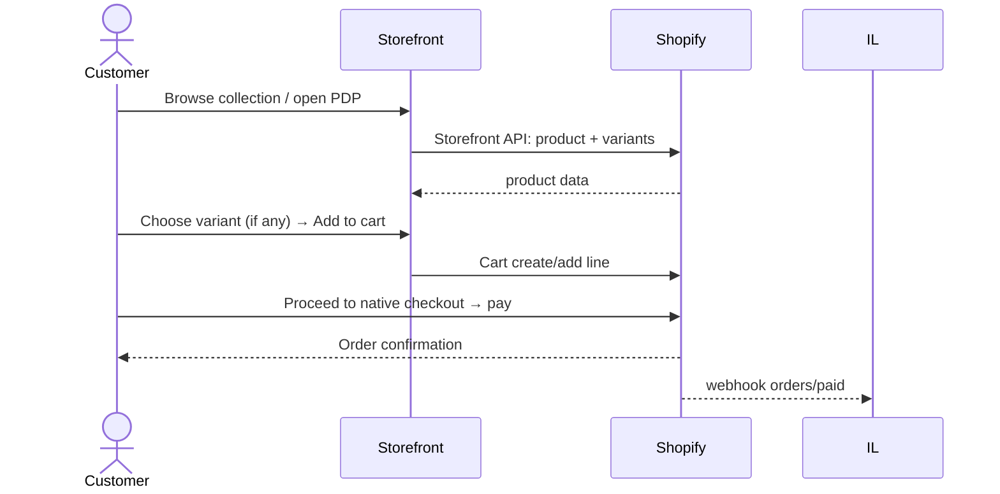
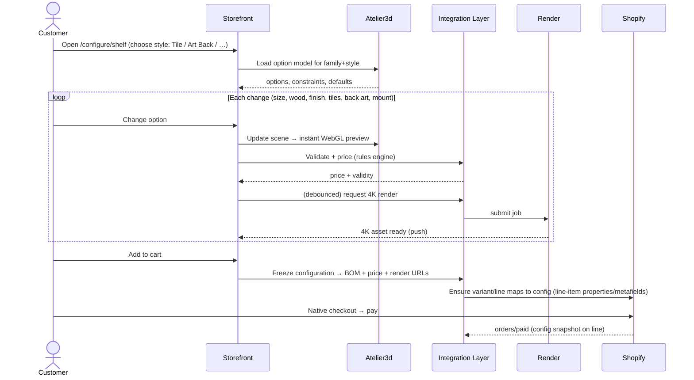
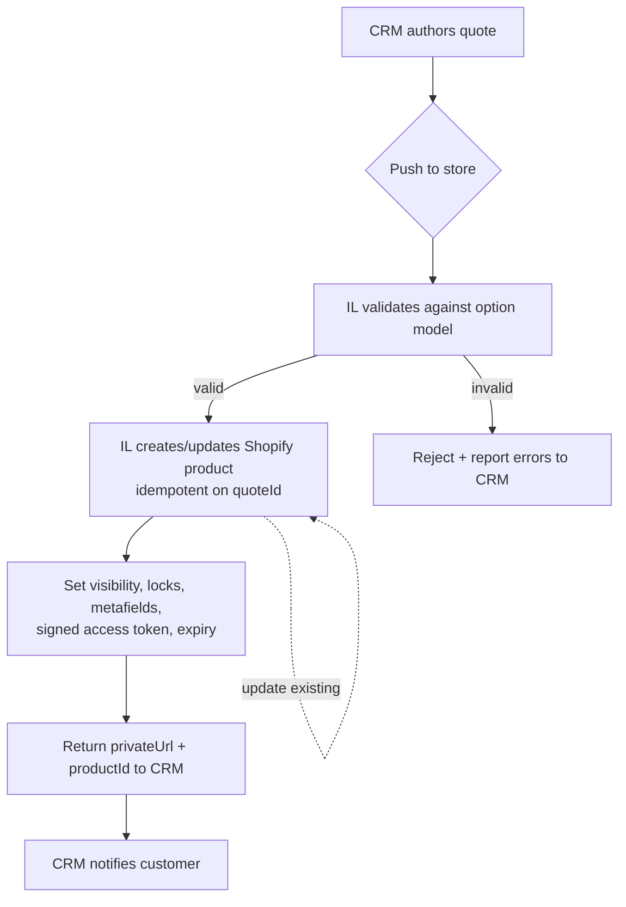
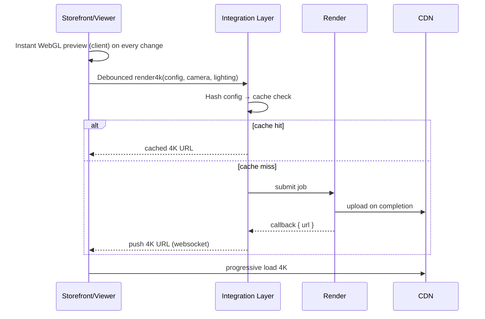
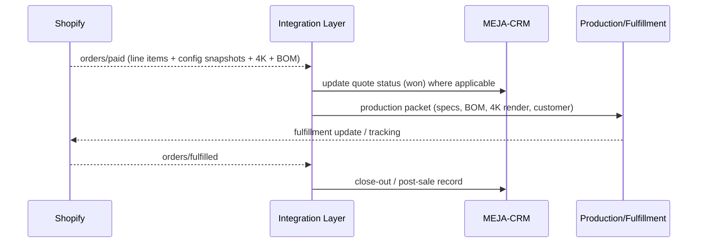

# MEJA Designs WebStore — Product Workflows

**Document type:** End-to-end workflows for every product type (for approval)
**Version:** 0.1 (Draft)
**Date:** 2026-06-13
**Companion:** [`01-Master-Plan.md`](01-Master-Plan.md) (architecture & API), [`02-UI-Design-Standard.md`](02-UI-Design-Standard.md) (UI).
**Status:** 🟡 Draft — awaiting workflow approval.

---

## 0. Scope

This document specifies, for **every product type**, the journey from entry → configuration → pricing → visualization → cart → checkout → fulfillment → post-order, plus the **system events** behind each step. Diagrams are Mermaid (render on GitHub). The five product types:

1. **Ready-Made Listing**
2. **Private / Unlisted Listing** (CRM-pushed, locked)
3. **Configurable Product** (shelves: Tile / Art Back / others)
4. **Hybrid Listing** (CRM-seeded but customer-editable)
5. **Custom Build-Out** (Atelier3d + live 4K render)

Plus three cross-cutting flows: **CRM quote push**, **live 4K rendering**, and **order → fulfillment**.

---

## 1. Legend & shared states

| Actor | Meaning |
|-------|---------|
| **Customer** | Shopper / account holder |
| **Storefront** | Custom storefront (reads Storefront API, hosts configurator/viewer) |
| **IL** | Integration Layer (middleware, mapping, pricing, orchestration) |
| **Shopify** | Commerce system of record (catalog, cart, checkout, orders) |
| **CRM** | MEJA‑CRM Quoting platform |
| **Atelier3d** | 3D configurator service |
| **Render** | 4K rendering engine |

**Shared option states:** `editable` · `locked` (read-only) · `invalid` (fails a constraint). **Shared listing visibility:** `public` · `private`.

---

## 2. Workflow A — Ready-Made Listing

**Goal:** the simplest path; buy a stocked/standard product.



**Steps**
1. Discover via collection, search, or home.
2. PDP shows photos, price, simple variants (size/color).
3. Add to cart → Shopify-native checkout.
4. `orders/paid` webhook → routine fulfillment (Workflow H).

**Notes:** no configurator, no render job. Pricing = Shopify. This is the baseline every other workflow extends.

---

## 3. Workflow B — Private / Unlisted Listing (CRM-pushed, locked)

**Goal:** a specific customer buys a quote prepared just for them; options are **locked**.


**Rules**
- **Visibility:** excluded from nav, search, sitemap, collections.
- **Access:** signed expiring URL **and/or** logged-in customer scope (Decision D5 = both).
- **Locked options:** rendered as read-only chips; no price recompute.
- **Expiry:** expired link → friendly "this quote has expired, contact us / request refresh" → IL can ask CRM to re-issue.
- **Pricing authority:** CRM price is authoritative and frozen.

---

## 4. Workflow C — Configurable Product (Shelves: Tile / Art Back / others)

**Goal:** self-serve configuration with **live price** and **live visualization**. Flagship for shelves.



**Steps**
1. Enter configurator; pick **style** (Tile, Art Back, or another configured style — *styles are data*).
2. Adjust options: dimensions (steppers), wood (swatches), finish, **tile count/layout** (Tile) or **back art asset** (Art Back), mounting.
3. **Constraints** enforced live (e.g., tile grid must fit dimensions; certain finishes only on certain woods).
4. **Price** recomputes via the Rules Engine on each valid change; breakdown expandable.
5. **Visualization:** instant WebGL preview; async 4K for hero/PDP/order.
6. Add to cart → config **frozen** (BOM, price, render URLs snapshotted) → native checkout.

**Why "not limited to two styles":** Tile and Art Back are the first two **style entries** in the option model. Adding *Floating*, *Ledge*, *Grid*, or *Modular* = new data + assets, **no redeploy**.

---

## 5. Workflow D — Hybrid Listing (CRM-seeded, customer-editable)

**Goal:** CRM pushes a *pre-customized* private listing, **but the customer can still change selected (unlocked) options.** This is the bridge between Workflow B and C.

```mermaid
sequenceDiagram
    actor C as Customer
    participant CRM as MEJA-CRM
    participant IL as Integration Layer
    participant ST as Storefront
    participant R as Render
    participant SH as Shopify
    CRM->>IL: Push quote (some options locked, some editable, base price, scope)
    IL->>SH: Create product (visibility per scope) + seed config metafields
    IL-->>CRM: { productId, link, expiresAt }
    C->>ST: Open listing (signed link or account)
    ST-->>C: "Prepared for you" + seeded config; locked=read-only, editable=interactive
    loop Customer edits an UNLOCKED option
        C->>ST: Change editable option
        ST->>IL: Validate + price delta (rules engine), respecting locked baseline
        IL-->>ST: new price + validity
        ST->>R: (debounced) re-render 4K
        R-->>ST: updated render
    end
    C->>SH: Add to cart → native checkout → pay
    SH-->>IL: orders/paid → reconcile to CRM quote
```

**Rules**
- **Per-option locking** comes from CRM (`locked:true|false`).
- **Pricing (Decision D4 = hybrid):** locked portion = CRM baseline (frozen); editable changes = **rules-engine deltas** applied on top.
- **Guardrails:** editable options still obey the same constraints as Workflow C; a customer can't edit into an invalid/locked-incompatible state.
- **Reconciliation:** final purchased config is sent back to CRM so the quote record matches what was actually bought.

---

## 6. Workflow E — Custom Build-Out (Atelier3d + live 4K)

**Goal:** design a bespoke piece from a richer starting point; the most open-ended path.


**Steps**
1. Enter from a template (recommended) or blank canvas in Atelier3d.
2. Design in 3D; BOM accumulates; price + **feasibility** flags update live.
3. **Two outcomes:**
   - **Buyable now** → straight to cart/checkout (config + 4K + BOM attached).
   - **Needs review** (complex joinery, oversized, special material) → submit to CRM, which returns a **private/hybrid** listing (loops into Workflow B/D).
4. Order carries the **full configuration, BOM, and 4K render** for production.

---

## 7. Workflow F — CRM Quote Push (cross-cutting)

The mechanism behind Workflows B & D, and the review outcome of E.



- **Idempotent** on `quoteId` (re-push updates, never duplicates).
- **Validation** rejects quotes that violate the option model and reports back.
- **Lifecycle:** active → expired → (refresh/re-issue) → won (order paid) / lost.

---

## 8. Workflow G — Live 4K Rendering (cross-cutting)

Shared by Workflows C, D, E.



**Principles:** never block interaction on 4K; cache by config hash; attach final 4K URL to the order line.

---

## 9. Workflow H — Order → Fulfillment (cross-cutting)



**Notes:** the **production packet** is the single artifact the workshop builds from — it must contain the exact configuration, BOM, dimensions, materials, and the 4K render the customer approved.

---

## 10. Decision points summary (per workflow)

| Workflow | Key approval decision (see Master Plan §16) |
|----------|---------------------------------------------|
| B Private | D5 access model (signed URL + account) |
| C Configurable | D8 launch styles beyond Tile/Art Back; D7 render fallback |
| D Hybrid | D4 pricing authority (hybrid per-option) |
| E Custom | self-serve threshold vs. forced CRM review (propose: feasibility flags decide) |
| F Push | idempotency + expiry policy |
| G Render | D7 WebGL-first, 4K async |

**Open workflow question (E):** what defines "needs human review" vs "buyable now"? Proposed: a feasibility ruleset (max size, allowed materials, joinery complexity). **Please confirm.**

---

## 11. Error & edge handling (all workflows)

| Situation | Behavior |
|-----------|----------|
| Render engine down | Stay on WebGL preview; mark 4K "pending"; allow checkout with preview; backfill 4K to order. |
| Invalid configuration | Block add-to-cart; inline explain the failing constraint; suggest nearest valid. |
| Expired private link | Friendly expiry page; one-click "request refreshed quote" → CRM. |
| Price mismatch (CRM vs rules) | Locked options win from CRM; reconciliation job flags drift for ops. |
| Out-of-stock component (BOM) | Surface lead-time/feasibility; offer alternates. |
| Customer not logged in for private listing | Token grants scoped access; prompt login to save/track. |

---

_End of Product Workflows (Draft v0.1). Please approve the flows and the open question in §10._
