# MEJA Designs WebStore — Product Workflows

**Document type:** End-to-end workflows for every product type (for approval)
**Version:** 0.2 (Draft — reconciled with the real CRM job-queue / pricing / listings contracts)
**Date:** 2026-06-13
**Companion:** [`01-Master-Plan.md`](01-Master-Plan.md) (architecture & API), [`02-UI-Design-Standard.md`](02-UI-Design-Standard.md) (UI).
**Status:** 🟡 Draft — awaiting workflow approval.

---

## 0. Scope

This document specifies, for **every product type**, the journey from entry → configuration → pricing → visualization → cart → checkout → fulfillment → post-order, plus the **system events** behind each step. Diagrams are Mermaid (render on GitHub). The five product types:

1. **Ready-Made Listing**
2. **Private / Unlisted Listing** (CRM-pushed, locked)
3. **Configurable Product** (shelves: Tile / Art Back / others)
4. **Hybrid Listing** (CRM-seeded but customer-editable)
5. **Custom Build-Out** (Atelier3d + live 4K render)

Plus three cross-cutting flows: **CRM quote push**, **live 4K rendering**, and **order → fulfillment**.

Workflows A–H below cover the **customer & system** path. **§12 adds the operational (back-of-house) workflow** the production/ops team follows to fulfill each product type — intake, spec verification, sourcing, build, QA, pack, ship, and close-out.

---

## 1. Legend & shared states

| Actor | Meaning |
|-------|---------|
| **Customer** | Shopper / account holder |
| **Storefront** | **Shopify Online Store 2.0 theme** (Liquid) with the **4kGraphics engine embedded**; hosts the configurator/viewer |
| **CRM** | **MEJA‑CRM** (Next.js + Supabase) — **system of record + integration hub**: catalog, pricing engine, quotes, listings, work orders, and the `integration_jobs` queue |
| **IL** | In these diagrams, **IL = the CRM's integration hub / job queue** (`integration_jobs`) — not a separate middleware. See [`05-Integration-Context.md`](05-Integration-Context.md). |
| **Shopify** | Storefront + checkout + orders/payments (commerce); listings published from the CRM |
| **Atelier3D** | Parametric design studio (React + Three.js + NestJS) — `atelier_import` worker |
| **Render** | **4kGraphics** — embeddable engine (preview + client 4K) + headless `/v1/render` · `/v1/buildplan` (`render_4k` worker) |

> **Integration = the CRM's typed job queue** (`integration_jobs`: enqueue → claim → complete → requeue ≤3× → reap). **Pricing = the CRM engine only** (golden-tested). The store never computes price.

**Shared option states:** `editable` · `locked` (read-only) · `invalid` (fails a constraint). **Shared listing visibility:** `public` · `private`.

---

## 2. Workflow A — Ready-Made Listing

**Goal:** the simplest path; buy a stocked/standard product.

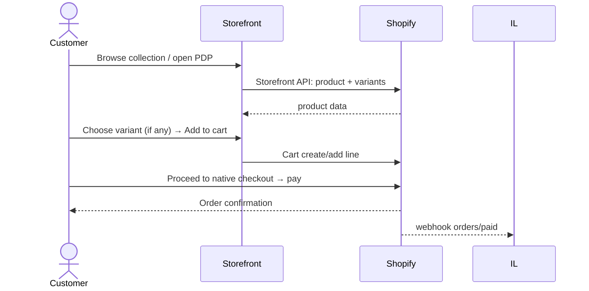

**Steps**
1. Discover via collection, search, or home.
2. PDP shows photos, price, simple variants (size/color).
3. Add to cart → Shopify-native checkout.
4. `orders/paid` webhook → routine fulfillment (Workflow H).

**Notes:** no configurator, no render job. Pricing = Shopify. This is the baseline every other workflow extends.

---

## 3. Workflow B — Private / Unlisted Listing (CRM-pushed, locked)

**Goal:** a specific customer buys a quote prepared just for them; options are **locked**.

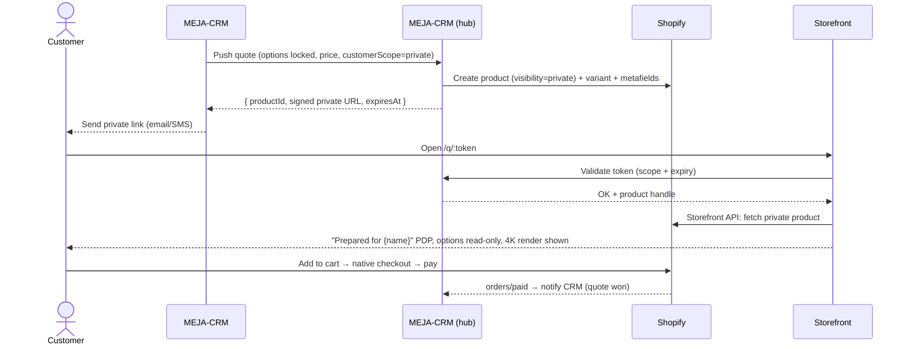

**Rules**
- **Visibility:** excluded from nav, search, sitemap, collections.
- **Access:** signed expiring URL **and/or** logged-in customer scope (Decision D5 = both).
- **Locked options:** rendered as read-only chips; no price recompute.
- **Expiry:** expired link → friendly "this quote has expired, contact us / request refresh" → IL can ask CRM to re-issue.
- **Pricing authority:** CRM price is authoritative and frozen.

---

## 4. Workflow C — Configurable Product (Shelves: Tile / Art Back / others)

**Goal:** self-serve configuration with **live price** and **live visualization**. Flagship for shelves.

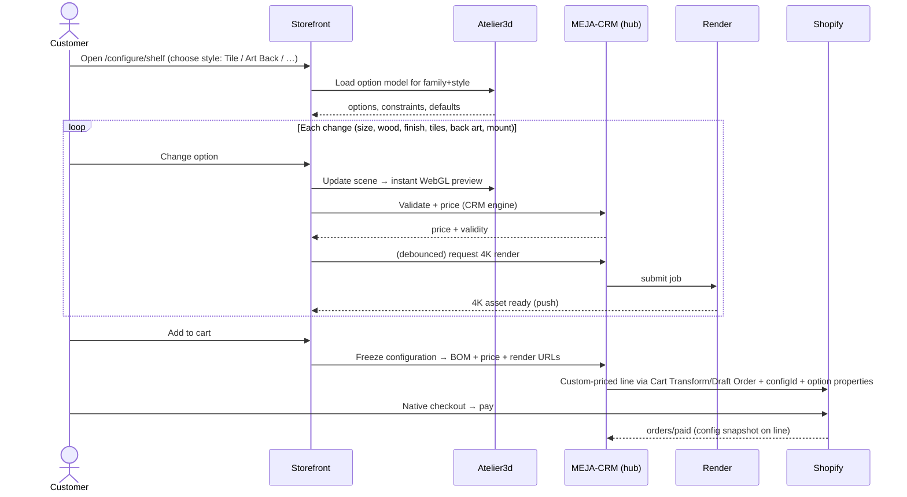

**Steps**
1. Enter configurator; pick **style** (Tile, Art Back, or another configured style — *styles are data*).
2. Adjust options: dimensions (steppers), wood (swatches), finish, **tile count/layout** (Tile) or **back art asset** (Art Back), mounting.
3. **Constraints** enforced live (e.g., tile grid must fit dimensions; certain finishes only on certain woods).
4. **Price** recomputes via the **CRM pricing engine** on each valid change; breakdown expandable.
5. **Visualization:** instant WebGL preview; async 4K for hero/PDP/order.
6. Add to cart → config **frozen** (BOM, price, render URLs snapshotted) → native checkout.

**Why "not limited to two styles":** Tile and Art Back are the first two **style entries** in the option model. Adding *Floating*, *Ledge*, *Grid*, or *Modular* = new data + assets, **no redeploy**.

---

## 5. Workflow D — Hybrid Listing (CRM-seeded, customer-editable)

**Goal:** CRM pushes a *pre-customized* private listing, **but the customer can still change selected (unlocked) options.** This is the bridge between Workflow B and C.

```mermaid
sequenceDiagram
    actor C as Customer
    participant CRM as MEJA-CRM
    participant IL as MEJA-CRM (hub)
    participant ST as Storefront
    participant R as Render
    participant SH as Shopify
    CRM->>IL: Push quote (some options locked, some editable, base price, scope)
    IL->>SH: Create product (visibility per scope) + seed config metafields
    IL-->>CRM: { productId, link, expiresAt }
    C->>ST: Open listing (signed link or account)
    ST-->>C: "Prepared for you" + seeded config; locked=read-only, editable=interactive
    loop Customer edits an UNLOCKED option
        C->>ST: Change editable option
        ST->>IL: Validate + price (CRM engine), respecting locked baseline
        IL-->>ST: new price + validity
        ST->>R: (debounced) re-render 4K
        R-->>ST: updated render
    end
    C->>SH: Add to cart → native checkout → pay
    SH-->>IL: orders/paid → reconcile to CRM quote
```

**Rules**
- **Per-option locking** comes from CRM (`locked:true|false`).
- **Pricing (Decision D4 = hybrid):** locked portion = CRM baseline (frozen); editable changes = **rules-engine deltas** applied on top.
- **Guardrails:** editable options still obey the same constraints as Workflow C; a customer can't edit into an invalid/locked-incompatible state.
- **Reconciliation:** final purchased config is sent back to CRM so the quote record matches what was actually bought.

---

## 6. Workflow E — Custom Build-Out (Atelier3d + live 4K)

**Goal:** design a bespoke piece from a richer starting point; the most open-ended path.

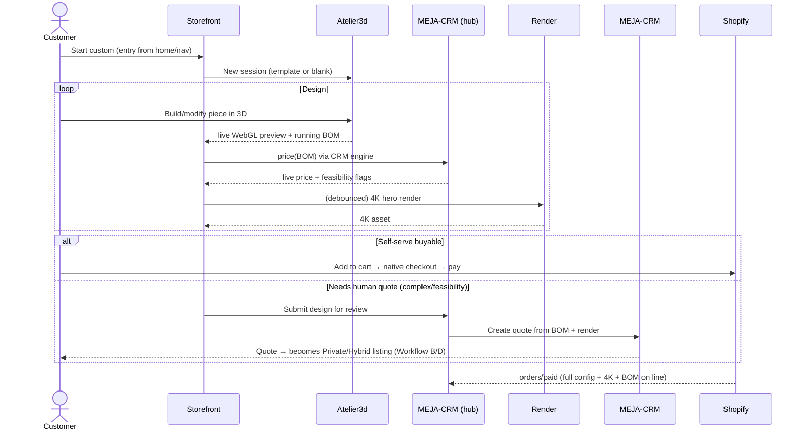

**Steps**
1. Enter from a template (recommended) or blank canvas in Atelier3d.
2. Design in 3D; BOM accumulates; price + **feasibility** flags update live.
3. **Two outcomes:**
   - **Buyable now** → straight to cart/checkout (config + 4K + BOM attached).
   - **Needs review** (complex joinery, oversized, special material) → submit to CRM, which returns a **private/hybrid** listing (loops into Workflow B/D).
4. Order carries the **full configuration, BOM, and 4K render** for production.

---

## 7. Workflow F — CRM Quote Push (cross-cutting)

The mechanism behind Workflows B & D, and the review outcome of E.

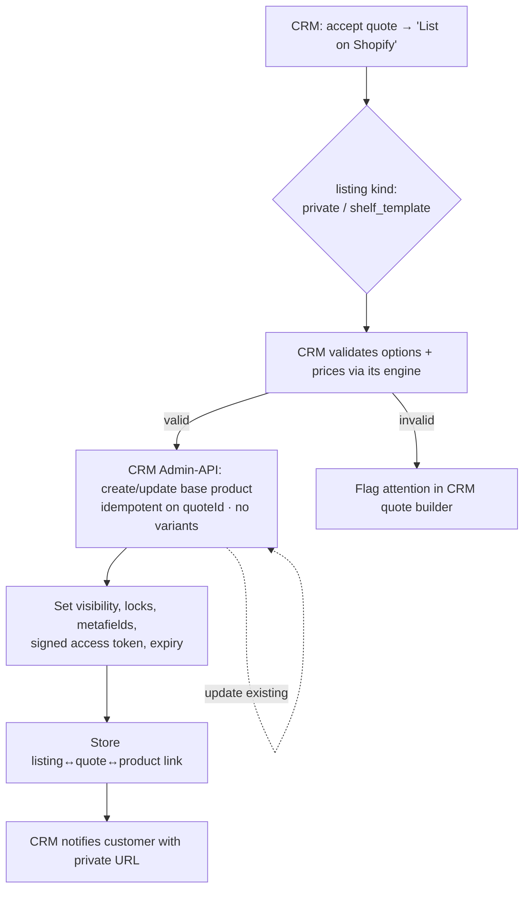

- **CRM-native:** this is the CRM's "List on Shopify" producer on an accepted quote (`listings` row, kind `private`/`shelf_template`); private listings **require a quote**.
- **Idempotent** on `quoteId` (re-push updates the listing, never duplicates).
- **Pricing** comes from the CRM engine; the store never recomputes.
- **Lifecycle:** active → expired → (refresh/re-issue) → won (order paid) / lost.

---

## 8. Workflow G — Live 4K Rendering (cross-cutting)

Shared by Workflows C, D, E.

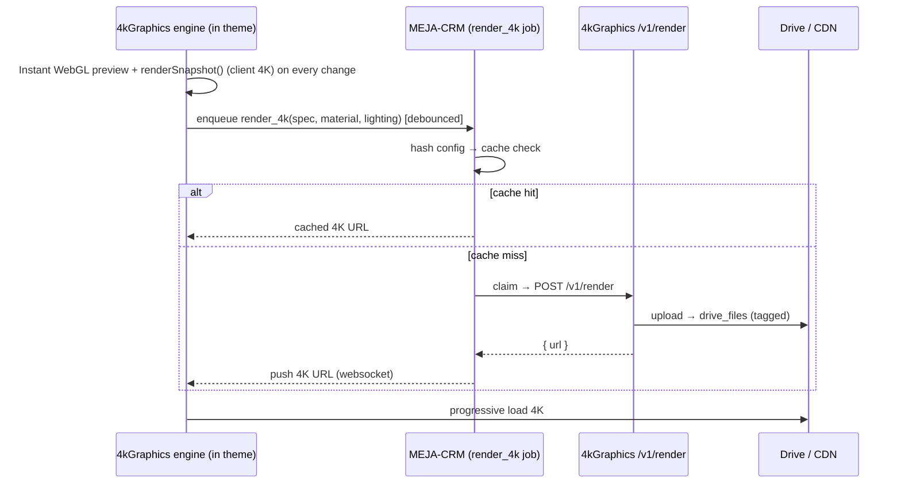

**Principles:** never block interaction on 4K (the embedded engine gives instant preview + client 4K); cache by config hash; **BOM/cut list = `getBuildPlan()` / `/v1/buildplan`** (same part layout as the render); attach final 4K URL + build plan to the order line.

---

## 9. Workflow H — Order → Fulfillment (cross-cutting)

```mermaid
sequenceDiagram
    participant SH as Shopify
    participant CRM as MEJA-CRM (store_orders)
    participant WO as Work order / cut_parts
    participant OPS as Production/Fulfillment
    SH-->>CRM: order webhook → store_orders + order_lines (configId, 4K, build plan)
    CRM->>CRM: mark quote won (if quote-linked); buyer w/o quote → auto-create customer
    CRM->>WO: generate work order → freeze flattened cut list (cut_parts)
    WO->>OPS: shop cut-ticket (specs, BOM, 4K render, customer)
    OPS-->>SH: fulfillment update / tracking (shipments)
    SH-->>CRM: orders/fulfilled → close-out / post-sale
```

**Notes:** Shopify orders are ingested into the CRM's **`store_orders`/`order_lines`**, generate a **work order** with a frozen **`cut_parts`** cut list, and print a **shop cut-ticket** — the single artifact the workshop builds from (exact configuration, BOM, dimensions, materials, and the approved 4K render).

---

## 10. Decision points summary (per workflow)

| Workflow | Key approval decision (see Master Plan §16) |
|----------|---------------------------------------------|
| B Private | D5 access model (signed URL + account) |
| C Configurable | D8 launch styles beyond Tile/Art Back; D7 render fallback |
| D Hybrid | D4 pricing authority (CRM engine is sole authority) |
| E Custom | self-serve threshold vs. forced CRM review (propose: feasibility flags decide) |
| F Push | idempotency + expiry policy |
| G Render | D7 WebGL-first, 4K async |

**Open workflow question (E):** what defines "needs human review" vs "buyable now"? Proposed: a feasibility ruleset (max size, allowed materials, joinery complexity). **Please confirm.**

---

## 11. Error & edge handling (all workflows)

| Situation | Behavior |
|-----------|----------|
| Render engine down | Stay on WebGL preview; mark 4K "pending"; allow checkout with preview; backfill 4K to order. |
| Invalid configuration | Block add-to-cart; inline explain the failing constraint; suggest nearest valid. |
| Expired private link | Friendly expiry page; one-click "request refreshed quote" → CRM. |
| Price mismatch (store display vs CRM) | CRM pricing engine is sole authority; store re-fetches the CRM price; reconciliation flags drift at order ingest. |
| Out-of-stock component (BOM) | Surface lead-time/feasibility; offer alternates. |
| Customer not logged in for private listing | Token grants scoped access; prompt login to save/track. |

---

## 12. Operational workflows (back-of-house) — per product type

Workflows A–H describe the **customer & system** journey. This part describes what the **operations / production team** does once an order is placed, for each product type. The shared starting point is the **production packet** from Workflow H (configuration + BOM + the approved 4K render + customer details). **The approved 4K render is the visual spec of record** — QA builds and checks against it.

**Operational role codes:**

| Code | Role |
|------|------|
| **CS** | Sales / Customer Service |
| **OPS** | Production scheduler / Ops lead |
| **MK** | Maker / craftsperson (incl. finishing) |
| **QA** | Quality control |
| **SHIP** | Fulfillment / shipping |
| **SYS** | CRM job queue / integrations (automated) |

---

### 12.1 Ready-Made — operations

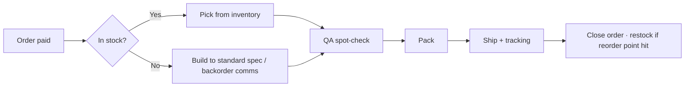

- **Owner:** SHIP (stocked) or MK→SHIP (made-to-order); OPS accountable.
- **Lead time / SLA:** in-stock ship in 1–2 business days; made-to-order standard 1–2 weeks.
- **Exceptions:** out of stock → backorder comms + ETA (CS); failed spot-check → pull + replace.

### 12.2 Private / Unlisted (locked) — operations

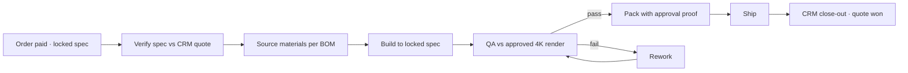

- **Owner:** OPS (verify) → MK (build) → QA → SHIP; CS consulted on any ambiguity.
- **Lead time / SLA:** per quote (set in CRM); confirm at intake.
- **Exceptions:** spec ambiguity → **CS confirms with customer before build** (locked spec is authoritative, never silently changed); material substitution requires CS sign-off.

### 12.3 Configurable shelves (Tile / Art Back / others) — operations

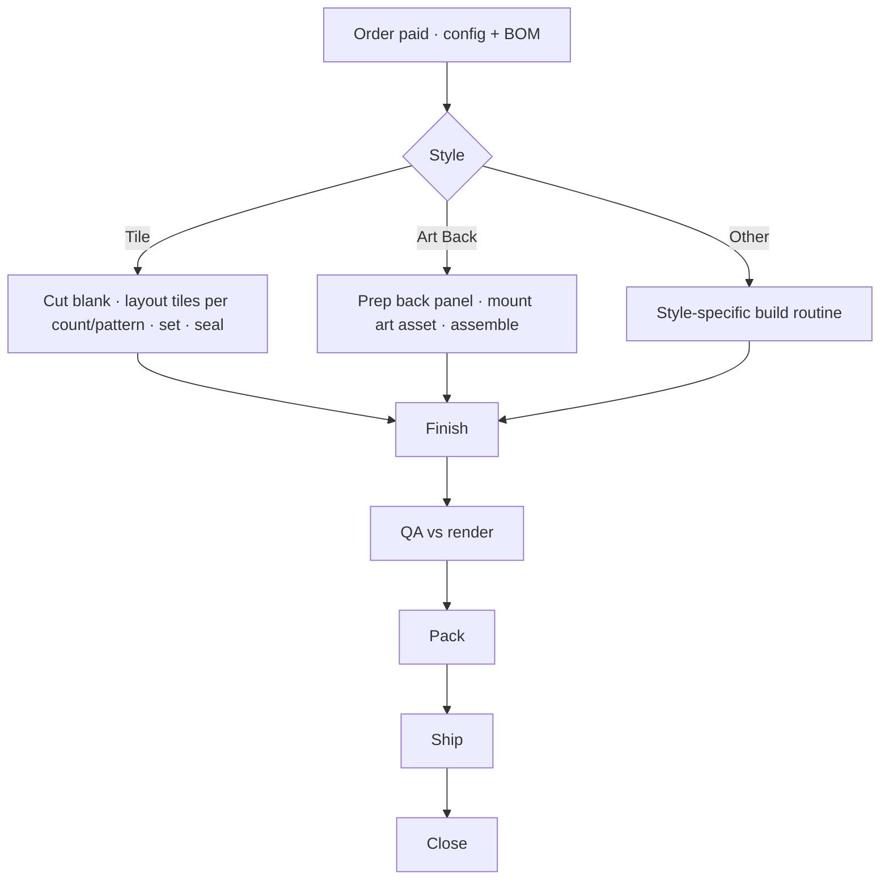

- **Owner:** MK (build per style jig/template) → QA → SHIP; OPS schedules by style queue.
- **Style notes:** *Tile* uses a layout jig keyed to tile count/pattern; *Art Back* keys to the selected back-art asset; new styles add a build routine, **no process rewrite**.
- **Lead time / SLA:** typically 1–3 weeks depending on size/finish.
- **Exceptions:** component shortage → substitute (within rules) or CS comms; render mismatch at QA → rework before pack.

### 12.4 Hybrid (CRM-seeded, customer-edited) — operations

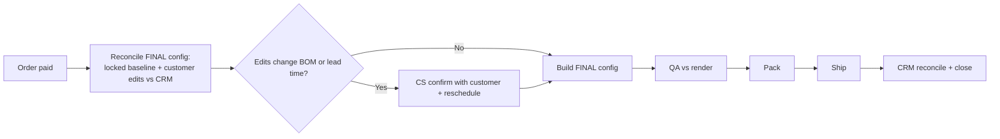

- **Owner:** OPS (reconcile) → MK → QA → SHIP; SYS reconciles final config back to the CRM quote.
- **Critical rule:** ops builds the **final purchased configuration** (locked baseline **plus** customer edits) — *not* the original quote. Always confirm which BOM is authoritative at intake.
- **Lead time / SLA:** as configurable; recompute if edits change the BOM.
- **Exceptions:** customer edits push past capacity/lead time → CS reschedule + confirm.

### 12.5 Custom build-out (Atelier3d) — operations

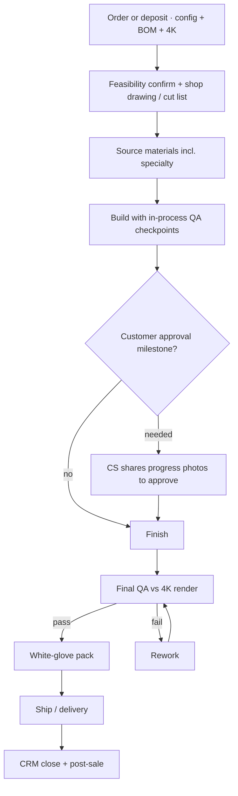

- **Owner:** OPS + MK (highest-touch); CS owns customer approval milestones; QA accountable for final sign-off vs render.
- **Lead time / SLA:** longest; quoted per piece (often via CRM deposit path before build).
- **Exceptions:** post-order feasibility fail (rare) → CS + redesign/remake (refund **only** if MEJA cannot fulfill — there are no customer-initiated returns, see §12.6); specialty material delay → ETA comms; milestone rejection → revise before continuing.

### 12.6 Cross-cutting operational flows

| Flow | What it does |
|------|--------------|
| **Materials & inventory** | BOM → stock check → reorder; maintain safety stock for common woods/tiles/finishes; flag long-lead specialty items at intake. |
| **QA — render vs build** | The approved **4K render is the spec of record**; QA verifies the built piece matches it (dimensions, wood, finish, layout) before pack. |
| **No returns — all items custom-made · rework / remake** | **Every product is made to order, so there are no returns or exchanges.** This is stated clearly on the PDP, in the cart, at checkout, and in CS comms. If an item arrives **defective or not matching the approved 4K render**, MEJA repairs, reworks, or remakes it; such cases are logged to CRM. Refunds occur **only** where MEJA cannot fulfill an order it accepted. |
| **Capacity & scheduling** | OPS queues by product type; WIP limits per maker; lead-time SLAs published to CS so quotes/PDP show realistic ship dates. |

### 12.7 Operational RACI (by stage)

| Operational stage | R (does it) | A (owns outcome) | C / I |
|-------------------|-------------|------------------|-------|
| Intake / packet receipt | SYS → OPS | OPS | CS |
| Spec verify & feasibility | OPS | OPS | CS, MK (custom) |
| Source materials (BOM) | OPS | OPS | MK |
| Build | MK | OPS | QA |
| QA vs approved render | QA | OPS | MK |
| Pack & ship | SHIP | OPS | CS |
| Close-out / CRM reconcile | SYS | OPS | CS |

### 12.8 Operational metrics (feed the KPIs in Master Plan §14)

- **On-time-ship rate** vs. promised lead time, per product type.
- **First-pass QA yield** (built right the first time; render-match rate).
- **Rework rate** and average rework time.
- **Production cycle time** per type (intake → ship).
- **Material stockout incidents** affecting promised dates.

---

_End of Product Workflows (Draft v0.1). Please approve the flows — customer/system (§2–9) and operational (§12) — and the open question in §10._
