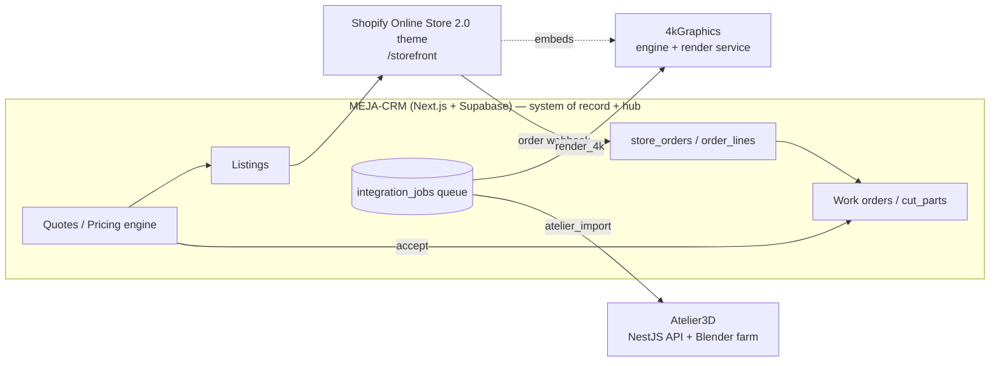

# Integration Context — the three connected apps (field notes)

**Document type:** Captured context from reviewing the live sibling repos (for the plan)
**Date:** 2026-06-13
**Source:** public snapshots of `jfsgi/MEJA-CRM-OrderManagement`, `jfsgi/MEJAFurnitureDesign-` (Atelier3D), `jfsgi/4kGraphics`, reviewed 2026-06-13. _(Repos may be private again now — this file is the durable capture.)_
**Status:** 🟢 Reference — used to reconcile the Master Plan with the real systems.

> Why this exists: the four "systems" in the Master Plan are **real, in-flight applications** with documented contracts, not greenfield. This note records what they actually are and **where the Master Plan must change to match them** (§4).

---

## 1. The three apps as they actually exist

### 1.1 MEJA‑CRM‑OrderManagement — the business system of record + integration hub
- **What:** a rebuild of "MEJA Production" — **CRM · Quoting · Work Orders · Listings · Shopify storefront · Ad Studio · Shipping**.
- **Stack:** **Next.js 15** (App Router, server actions) on **Vercel**; **Supabase** (Postgres 16, RLS, Auth, Edge Functions, pg_cron); **Drizzle** ORM; **Google Workspace** Drive for images; **Tailwind v4** mapped to **`--mj-*` tokens** (token-only color rule); **Zod** validation.
- **Maturity:** schema (36 tables) approved; design system "**Indigo Atelier**" locked; **quote builder** (Phase 5) and **work orders + cut lists** (Phase 6) **complete**, pricing engine **golden-tested to the cent** on ~50 historical quotes. **Listings (Phase 8)** and **Integrations/job-queue (Phase 7)** are **in progress**.
- **Storefront intent (their plan):** "**Shopify Online Store 2.0 theme in `/storefront` — Phase 8.**"

### 1.2 MEJAFurnitureDesign‑ = **Atelier3D** — parametric design studio
- **What:** web 3D parametric furniture design (Design / Studio / Documents workspaces). Smart parametric components, X/Y/Z adaptation, cut lists/BOM, CNC **DXF/STEP** export, marketing renders/turntables.
- **Stack:** **React 19 + TypeScript + Vite + three.js (react-three-fiber)** + zustand + Web Workers (**OpenCascade.js** WASM); API = **Node + NestJS**; **Postgres + S3 + Redis/BullMQ**; render workers = **headless Blender + Cycles (GPU, up to 8K)**; geometry workers = **OCCT**.
- **Model:** a project is a serializable **JSON document** (tree of versioned component recipes + expressions); deterministic client/server parity. "Workshop" = per-user private component library.
- **Status:** Phase 0 app working (viewport, parametric runtime, inspector, live cut list/BOM, undo/redo, JSON save/open).

### 1.3 4kGraphics — the render engine (+ build-plan generator)
- **What:** renders furniture at **3840×2160 (2× supersample → 7680×4320 internal)** with **procedural PBR materials** (oak/walnut/cherry/cedar/paints/steel/brass/linen — no texture downloads), **and** generates the **build plan** (cut list, hardware, tools, assembly steps, board-feet, shop-hours) from the **same part layout** — so *render and cut list can never disagree*.
- **Ships in three forms:** `@4kgraphics/engine` (embeddable TS/Three.js lib **and** a self-contained `browser.js` drop-in), `@4kgraphics/server` (headless render API), `apps/demo`.
- **Embeds anywhere:** the `browser.js` module loads via a `<script type="module">` in *any* server-rendered page (Flask/Django/PHP — **and a Shopify Liquid theme**). Client-side it exposes live orbit preview, `renderSnapshot()` → 4K PNG Blob, `getBuildPlan()` → cut-list JSON.

---

## 2. How they're actually wired (the real integration design)

- **CRM is the hub and the business system of record** (customers, products, quotes, pricing, work orders, listings). **Shopify is the storefront + checkout**, mirroring purchasable listings. **4kGraphics + Atelier3D are workers** behind the CRM's job queue.
- **Integration = a typed job-queue contract** (`integration_jobs`): enqueue → atomic claim (`SKIP LOCKED`) → complete → fail-with-requeue (≤3×) → reap-stuck. Worker API: `POST /api/jobs/claim`, `POST /api/jobs/[id]`, bearer-gated by `JOBS_WORKER_TOKEN`. Job kinds today: **`render_4k`** (→ 4kGraphics; image lands in Drive `drive_files`, tagged with product code) and **`atelier_import`** (→ builds a **draft product**, dims+parts pre-filled, `atelier_model_ref`). A **`shopify_push`** producer is the natural next kind.

### 2.1 4kGraphics contract (for the storefront/CRM)
- **Embedded (live preview + client 4K):** `new FurnitureEngine({container})`, `showFurniture(spec)`, `setMaterial(id, partName?)`, `setStain(id)`, `setLighting('studio'|'showroom'|'daylight')`, `setCameraOrbit()`, `renderSnapshot({width,height,supersample,transparent})` → PNG Blob, `getBuildPlan()` → cut list.
- **Headless service (server renders):** `POST /v1/render` (`{spec, material, lighting, textureSize}`) → 4K PNG; `POST /v1/buildplan` (`{spec}`) → build-plan JSON. Needs a persistent host (Railway/Fly/VPS), **not** Vercel.
- **Spec = plain JSON in millimeters**, `kind ∈ {table, bookshelf, cabinet, drawerbox, door, drawerfront, drawerunit, endtable}`. `validateSpec()` guards impossible geometry. Cut-list items also carry fractional-inch strings. **Note:** a **MEJA "shelf" (Tile / Art Back) is not yet a `kind`** — it must be authored as a parametric component (Atelier3D + 4kGraphics) or modeled via the CRM product/parts model.

---

## 3. CRM data model — the tables that matter for the store

From the approved ERD (`src/db/schema.ts`, 36 tables). Most relevant:

| Table | Why it matters to the store |
|-------|-----------------------------|
| `listings` | **Already the store-listing model:** `platform` (shopify·etsy), `kind` (**private · shelf_template · catalog**), links `product` + `quote`, `price`, `status`. **Private listings require a quote.** |
| `shelf_templates` | **The shelf option matrix** — the configurable-shelf definition (Tile / Art Back / …). This *is* the "Variant & Options Engine" home for shelves. |
| `store_orders` / `order_lines` | **Shopify order ingestion** (incl. deposit/balance "private flow"); store buyers on no-quote orders **auto-create a CRM customer**. |
| `integration_jobs` | The job-queue contract (above). |
| `product_types` / `product_parts` / `product_children` (+ `product_child_dims`/`dim_map`) | Parts-first parametric catalog: per-axis formulas `base − mult × sub + add` + `ticket_adj`; assemblies resize children via `dim_map`. Atelier3D imports land as **draft** product_types. |
| `materials` / `features` / `hardware` (+ `hardware_addons`) | Pricing inputs: cost/sqft, scrap, margin; feature pricing methods `each·sqft·linear_ft·min_plus_sqft`. |
| `quotes` / `quote_versions` / `line_items` (+ features/hardware/materials) | Quoting with **pricing snapshot columns** so re-pricing never rewrites history; immutable stored totals. |
| `assembly_cut_list` (view) | Resolves a product/line into the flattened cut list across the whole assembly — powers editor preview, quote rollup, and WO cut list. |
| `work_orders` / `wo_items` / `cut_parts` / `wo_step_progress` | Accept quote → WO; frozen cut list; data-driven `workflow_steps`. |

**Money/IDs convention:** `uuid` PKs, `numeric(12,2)` for money (never floats), `timestamptz` audit columns, soft-archive via `status`/`archived_at`.

---

## 4. 🔴 Reconciliations — where the Master Plan must change

| Plan area | My draft said | The real systems say | Recommended change |
|-----------|---------------|----------------------|--------------------|
| **D1 architecture** | Hybrid-headless (recommended) | CRM plans a **Shopify OS 2.0 theme** in `/storefront`; 4kGraphics `browser.js` embeds in a Liquid theme | **Re-recommend OS 2.0 theme + embedded 4kGraphics engine**; keep headless as optional for the most immersive pages only. Lowers cost/complexity. |
| **System of record** | "Shopify is the system of record" | **CRM (Supabase) owns** products, quotes, pricing, work orders, listings; Shopify owns storefront+checkout+payments | Reframe: **CRM = business system of record + hub; Shopify = commerce/checkout.** |
| **Integration Layer** | New middleware (API gateway + bus) | A **typed job-queue** (`integration_jobs`) + worker API already exist in the CRM | **Adopt/extend the CRM job queue**; add a `shopify_push` job + order-webhook ingestion. Don't build a parallel bus. |
| **Pricing engine** | New "Pricing Rules Engine" | CRM pricing engine **golden-tested to the cent** | **Pricing authority = CRM engine.** Shopify shows the CRM-computed price (Draft Orders / Functions); we don't re-derive. |
| **Product taxonomy** | ready-made / private / configurable / hybrid / custom | CRM listing kinds: **catalog / private / shelf_template** | Map ours → theirs: catalog=ready-made, private=private/unlisted (quote-required), **shelf_template=configurable shelves**; hybrid = quote-originated shelf_template with editable options. |
| **Variant & Options Engine (§5.4)** | New engine in our middleware | **`shelf_templates` table** + the parts/`dim_map` model already do this | Implement the option matrix **in the CRM `shelf_templates`**, surfaced to the theme; keep the "never native Shopify variants" conclusion. |
| **BOM / cut list** | We compute BOM | `assembly_cut_list` (CRM) **and** 4kGraphics `getBuildPlan()` — render & cut list share one layout | **Reuse those**; never invent a separate BOM. |
| **4K rendering** | Generic async render API | `render_4k` job → 4kGraphics; embeddable engine gives the instant WebGL preview | Two-tier still holds: **embedded engine = instant preview + client 4K; `render_4k` job = server 4K**. Confirms D7 (WebGL-first). |
| **UI design system** | 10 fresh iterations | CRM = **Indigo Atelier `--mj-*` tokens**; Atelier3D = warm-neutral + **teal** accent, dark Studio | **Harmonize the store with the suite**: consume the same `--mj-*` token philosophy / Indigo Atelier palette so CRM, Atelier3D, and store feel like one brand. The 10 iterations remain useful exploration; recommend the warm/atelier directions (#1/#2/#3) as closest fits. |

---

## 5. Open questions to confirm with the team
1. **D1:** go with **Shopify OS 2.0 theme + embedded 4kGraphics** (align with CRM Phase 8), or still pursue headless for flagship pages?
2. **Shelf as a parametric `kind`:** author "Tile" / "Art Back" shelves as 4kGraphics/Atelier3D parametric components, or model purely via CRM `shelf_templates` + parts? (Affects whether the configurator gets true live 3D for shelves.)
3. **Store theme tokens:** adopt the CRM's **Indigo Atelier `--mj-*`** tokens directly for one-brand consistency?
4. **Job kinds:** confirm a **`shopify_push`** job + **store-order webhook → `store_orders`** ingestion as the store↔CRM contract.
5. **Hosting:** 4kGraphics render service needs a persistent host (Railway/Fly/VPS) — who operates it?

---

_These reconciliations are not yet applied to the Master Plan / UI Standard / Workflows — they're staged here for approval. On your go-ahead I'll fold them in (notably Decision D1, the integration-layer section, the pricing-authority decision, the listings taxonomy, and the design-token alignment)._
