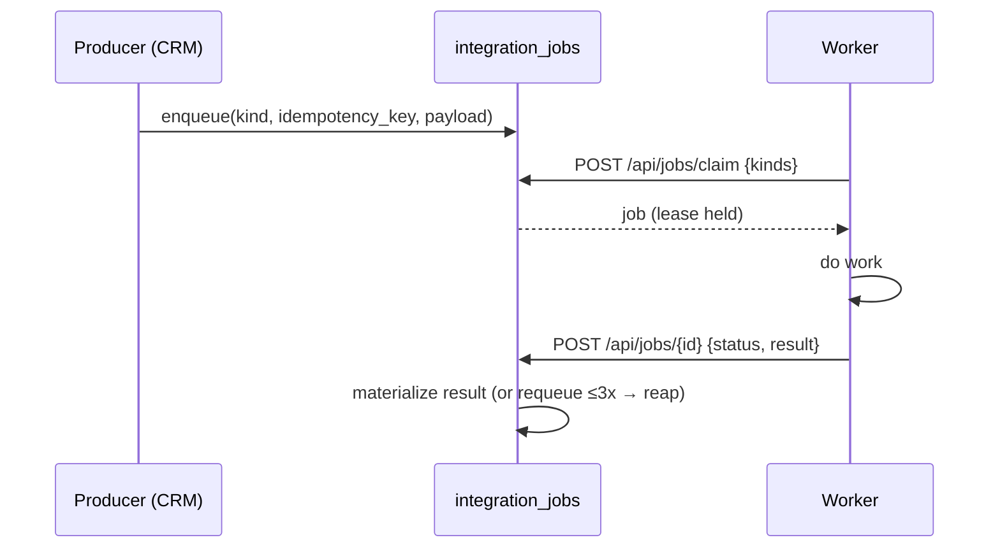

# MEJA WebStore — API & Job-Queue Contracts

**Document type:** Integration contract spec (for the CRM/engineering teams)
**Version:** 1.0 (Draft)
**Date:** 2026-06-13
**Machine-readable spec:** [`../api/openapi.yaml`](../api/openapi.yaml) (OpenAPI 3.1)
**Context:** [`05-Integration-Context.md`](05-Integration-Context.md) · [`01-Master-Plan.md` §6](01-Master-Plan.md)

---

## 0. Principle

Integration is coordinated by **MEJA‑CRM** (the hub) via its **typed job queue** (`integration_jobs`) plus **Shopify order webhooks**. No system calls another's internals directly. There are **four contracts**:

| # | Contract | Direction | Transport |
|---|----------|-----------|-----------|
| C1 | **Job queue** (worker + producer) | CRM ⇄ workers | REST, bearer `JOBS_WORKER_TOKEN` |
| C2 | **`shopify_push`** (publish listing) | CRM → Shopify | job kind → Shopify Admin API |
| C3 | **Order ingestion** | Shopify → CRM | webhook (HMAC) → `store_orders` |
| C4 | **Render** (`render_4k` / build plan) | CRM → 4kGraphics | `POST /v1/render`, `/v1/buildplan` |

---

## 1. The job queue (C1)

The existing CRM contract: **enqueue → atomic claim (`SKIP LOCKED`) → complete → fail-with-requeue (≤3×) → reap-stuck.**

- **Worker API:** `POST /api/jobs/claim` (claim next of given kinds), `POST /api/jobs/{id}` (report `complete`/`failed`). Bearer `JOBS_WORKER_TOKEN`.
- **Producer API:** `POST /api/jobs` with `{kind, idempotency_key, payload}`.
- **Kinds:** `render_4k` · `atelier_import` · **`shopify_push`** (new for the store).
- **Materialization:** results apply on completion only — a failed job is **never half-built** (e.g., `atelier_import` builds a draft product; `render_4k` records the image into `drive_files`).

## 2. Publish a listing — `shopify_push` (C2)

Producer on an **accepted quote** ("List on Shopify"). Payload: `quoteId` (idempotency key), `listingKind` (`catalog`/`private`/`shelf_template`), `productType`, `price` (CRM-computed), `options`, `render4kUrl`, `customerScope` (public, or private with `signedUrl`+`expiresAt`).

- Creates/updates a **base product** in Shopify (Admin API) — **never** per-combination variants (§5.4).
- **Configured line price** is set server-side via **Cart Transform Function** (Plus) or **Draft Orders** (D10).
- Private listings get `visibility=private` metafield + signed expiring access (D5).
- Powers Workflows **B / D / F**.

## 3. Order ingestion (C3)

`POST /webhooks/shopify/orders` handles `orders/create|paid|fulfilled`, **HMAC-verified**, **idempotent on Shopify order id**.

- Writes `store_orders` + `order_lines`; **line-item properties carry `configId` + config snapshot + `render4kUrl`**.
- Quote-linked → mark quote **won** + generate a **work order** (frozen `cut_parts`). No-quote buyer → **auto-create CRM customer**.
- Powers Workflow **H**; review invite (`review_request`) fires after `orders/fulfilled` (Workflow I).

## 4. Render & build plan (C4)

4kGraphics service (persistent host):
- `POST /v1/render` `{spec, material, lighting, textureSize}` → **4K PNG**.
- `POST /v1/buildplan` `{spec}` → **BuildPlan JSON** (cut list, hardware, tools, steps, board-feet, shop-hours).
- **`spec`** is plain JSON in **millimeters**; `kind ∈ {drawerbox, drawerunit, door, drawerfront, cabinet, bookshelf, table, endtable}`.
- The embedded engine also renders client-side previews + `renderSnapshot()`/`getBuildPlan()` — server `render_4k` is for PDP/order assets. Powers Workflow **G**.
- **Render and cut list share one part layout** — they can never disagree.

---

## 5. Cross-cutting rules

| Concern | Rule |
|---------|------|
| **Auth** | Workers: bearer `JOBS_WORKER_TOKEN`. Shopify webhooks: HMAC-SHA256 of raw body. Shopify Admin: OAuth. Private listings/render assets: short-lived signed URLs. |
| **Idempotency** | `shopify_push` on `quoteId`; webhooks on order id; `render_4k` on a config hash (cache reuse). |
| **Pricing authority** | **CRM pricing engine only** (D4). The store never computes price. |
| **Versioning** | Every contract is `v1`-prefixed; breaking changes ship a new version with a published deprecation window. |
| **Reliability** | Idempotent consumers; failed jobs requeue ≤3× then reap-stuck; correlation-ID tracing end-to-end. |
| **Money/IDs** | `numeric(12,2)` (minor units over the wire), `uuid` PKs, `timestamptz` audit columns (CRM ERD). |

## 6. Open items for the CRM team
1. Confirm `shopify_push` is added as a job kind (Phase 7/8 in progress).
2. Confirm Cart Transform Function vs Draft Orders split (D10) for self-serve vs quote-pushed lines.
3. Confirm the render service host + callback/websocket channel for 4K-ready push to the storefront.
4. Confirm `review_request` trigger + reviews-app ingestion (D13).

---

_End of API & Job-Queue Contracts (Draft v1.0). Pair with `api/openapi.yaml`._
